# Day 02 - Linux Architecture, Processes, and systemd

## Task

Concise recap of every challenge task from `README.md`:

- Explain core Linux components: kernel, user space, init/systemd.
- Understand how processes are created and managed.
- Learn what systemd does and why it matters for DevOps.
- Cover process states (running, sleeping, zombie, etc.).
- List at least 5 daily-use commands with purpose.
- Keep notes short, practical, and actionable (bullets + short headings).
- Use `man` pages (`ps`, `top`, `systemctl`) and systemd docs; focus on understanding, not copy-paste.

## Environment

| Item | Value | Install / Check Command |
|------|-------|--------------------------|
| OS | Ubuntu 22.04/24.04 LTS (any systemd Linux works; WSL2 Ubuntu is fine) | `cat /etc/os-release` |
| Shell | Bash | `echo $SHELL` |
| Must-have tools | `ps`, `top`, `pstree`, `systemctl`, `journalctl`, `pgrep`, `pidof`, `kill` (all preinstalled on Ubuntu) | `command -v ps systemctl journalctl` |
| Nice-to-have | `htop` (clearer UI), `man` pages | `sudo apt-get install -y htop man-db` |
| Service to inspect | Any systemd unit (examples use `ssh` / `systemd-journald`) | `systemctl list-units --type=service --state=running` |
| Learner values | Your kernel string, PID 1 name | `[TODO - run on your machine]` fill from `uname -a` and `cat /proc/1/comm` |

## Solution

### 1. Core Linux components (kernel, user space, init/systemd)

**Commands:**

```bash
uname -a
cat /etc/os-release
cat /proc/1/comm
ps -p 1 -o pid,comm,args
```

**Illustrative output (do not copy as your own — run on your machine):**

```text
$ uname -a
Linux devops-box 6.8.0-41-generic #41-Ubuntu SMP ... x86_64 GNU/Linux   # illustrative

$ cat /proc/1/comm
systemd   # illustrative — yours should also say systemd on modern Ubuntu
```

| Layer | What it does | DevOps example |
|-------|--------------|----------------|
| Hardware | CPU, RAM, disk, NIC | EC2 instance type decides all four |
| Kernel | Privileged core: schedules CPU, manages memory, drivers, syscalls, filesystems, networking | `uname -r` pins which kernel your container image expects |
| System calls | Bridge user space → kernel (`read`, `write`, `fork`, `exec`, `open`) | `strace -p <pid>` shows them live during debugging |
| User space | Unprivileged apps, shells, libraries (glibc), daemons | `nginx`, `docker`, your app |
| Shell | Command interpreter translating text → syscalls | `bash` running your CI scripts |
| init / systemd (PID 1) | First user-space process; boots system, starts services in order, restarts failures, collects logs | `systemctl restart nginx` after a deploy |
| Filesystem layout | Standard paths (`/etc` config, `/var/log` logs, `/usr` binaries) | Day 07 builds on this |

**Why it matters:** every "app is down" ticket is one of these layers failing. Knowing which layer owns the failure (kernel OOM vs. app config vs. systemd not restarting) decides whether you reboot, roll back, or edit a unit file.

### 2. How processes are created and managed

**Commands:**

```bash
ps -ef | head -10
ps aux --sort=-%cpu | head -10
pstree -p | head -20
cat /proc/<pid>/status | head -20
```

**Illustrative output:**

```text
$ ps -ef | head -5   # illustrative
UID    PID  PPID CMD
root     1     0 /sbin/init splash
root   312     1 /lib/systemd/systemd-journald
root   450     1 /usr/sbin/sshd -D

$ pstree -p | head -5   # illustrative
systemd(1)-+-systemd-journal(312)
           +-sshd(450)---sshd(1201)---bash(1202)
```

| Concept | Meaning | Command to see it |
|---------|---------|-------------------|
| `fork()` + `exec()` | Parent clones itself, child replaces image with new program | `pstree -p` shows parent → child chains |
| PID / PPID | Unique ID + parent ID; PID 1 is systemd | `ps -o pid,ppid,comm -p <pid>` |
| Process table | Kernel bookkeeping: state, priority (nice), CPU/mem, file descriptors | `/proc/<pid>/status`, `/proc/<pid>/fd/` |
| Signals | Messages to a process: `TERM` (15, graceful), `KILL` (9, force), `HUP` (1, reload) | `kill -l`, `kill <pid>`, `kill -9 <pid>` |
| Scheduler | Preemptive multitasking: kernel picks which runnable process gets CPU | `top` `%CPU` column, `uptime` load averages |
| Zombie vs orphan | Zombie = dead but parent hasn't `wait()`ed; orphan = parent died, reparented to PID 1 | `ps aux` shows `Z` / `defunct` |

**Why it matters:** deploys are process management (`ExecStart` spawns your app, `Restart=` policy decides resurrection). Misreading PPID chains is how people kill the wrong Java process in production.

### 3. Process states

**Commands:**

```bash
ps aux | head -10
top -b -n 1 | head -20
ps -o pid,stat,comm -p 1
```

| State | `STAT` letter | Meaning | What to do |
|-------|---------------|---------|------------|
| Running / Runnable | `R` | On CPU or waiting for CPU | Normal under load; sustained 100% → profile app |
| Interruptible sleep | `S` | Waiting for event/I/O, can be woken | Most common; normal |
| Uninterruptible sleep | `D` | Blocked in kernel I/O (disk/NFS), cannot be killed | Fix storage/network, not `kill -9` |
| Stopped | `T` | Paused by `SIGSTOP` / debugger | `kill -CONT <pid>` to resume |
| Zombie | `Z` | Dead, parent hasn't reaped (`defunct`) | Fix/restart the parent; zombies hold no CPU |
| Idle (kernel threads) | `I` | Kernel idle thread | Ignore |

**Why it matters:** during incidents the state letter is triage. `D`-heavy = storage problem. `Z` pile-up = parent bug. `R` storm = CPU saturation. You read this before you restart anything.

### 4. systemd — what it does and why it matters

**Commands:**

```bash
systemctl status systemd-journald --no-pager
systemctl list-units --type=service --state=running | head -15
systemctl cat ssh
systemctl is-enabled ssh
journalctl -u ssh --since -1h --no-pager | tail -20
```

**Illustrative output:**

```text
$ systemctl status systemd-journald --no-pager   # illustrative
* systemd-journald.service - Journal Service
   Loaded: loaded (/lib/systemd/system/systemd-journald.service; static)
   Active: active (running) since Mon 2026-09-28 10:00:00 UTC; 5 days ago
```

| systemd concept | Meaning | Example |
|-----------------|---------|---------|
| PID 1 | Boot anchor; everything descends from it | `cat /proc/1/comm` → `systemd` |
| Unit files | Declarative service definitions (`.service`, `.socket`, `.timer`, `.target`, `.mount`) | `/lib/systemd/system/nginx.service` |
| Dependencies | `After=` / `Requires=` / `Wants=` / `Before=` order startup | App `After=network.target postgresql.service` |
| Parallel boot | Independent units start concurrently | Faster cloud boots, faster ASG scale-out |
| `enable` vs `start` | `enable` = start on boot; `start` = start now | Production needs both: `enable --now` |
| `restart` vs `reload` | `restart` kills + starts; `reload` re-reads config without dropping connections | Prefer `reload` for nginx config changes |
| `Restart=` policy | Auto-resurrect crashed services (`always`, `on-failure`) | What keeps your app up at 3 AM |
| journal | Structured per-unit logs with time/priority filters | `journalctl -u nginx -p err --since -1h` |
| timers | cron replacement (`systemctl list-timers`) | Scheduled backups/cleanup |

**Why it matters:** systemd is the contract between your deploy and the OS: unit file declares how to start, when to restart, what order, and where logs go. Writing a correct unit file is a Day-1-on-the-job skill.

### 5. Anatomy of a systemd unit file (read one before you write one)

**Why:** "service won't start" is usually a bad unit file. Reading `systemctl cat` output field-by-field is faster than any tutorial.

```bash
systemctl cat ssh
```

**Illustrative unit (structure only — your paths/names will differ):**

```ini
# illustrative structure, not a literal copy of any distro file
[Unit]
Description=OpenBSD Secure Shell server
After=network.target auditd.service
ConditionPathExists=!/etc/ssh/sshd_not_to_be_run

[Service]
ExecStart=/usr/sbin/sshd -D
ExecReload=/bin/kill -HUP $MAINPID
KillMode=process
Restart=on-failure
RestartSec=42s

[Install]
WantedBy=multi-user.target
```

| Section | What it declares | Breakage it causes when wrong |
|---------|------------------|-------------------------------|
| `[Unit]` + `After=`/`Requires=` | Start order and dependencies | Starts before network/DB → immediate crash loop |
| `ExecStart=` | The exact command PID 1 runs | Typo here = `failed (exit-code)` with no app logs |
| `ExecReload=` | How to re-read config without restart | Missing reload forces full restarts (drops connections) |
| `Restart=` / `RestartSec=` | Auto-resurrection policy + delay | `no` means 3 AM pages; too-fast retry means tight crash loop |
| `[Install]` + `WantedBy=` | Which target pulls it in on boot | Wrong target = never starts after reboot despite `enable` |

**Signal cheat sheet (how you talk to processes):**

| Signal | Number | Effect | When to use |
|--------|--------|--------|-------------|
| `TERM` | 15 (default `kill`) | Ask to exit cleanly (catchable) | Always first |
| `HUP` | 1 | Reload config (many daemons) | `kill -HUP <pid>` instead of restart |
| `INT` | 2 | Interrupt (like `Ctrl+C`) | Foreground jobs |
| `KILL` | 9 (`kill -9`) | Force kill (uncatchable) | Last resort; orphans locks/sockets |
| `STOP` / `CONT` | 19 / 18 | Pause / resume | Freeze a runaway for inspection |

### 6. Five daily-use commands (with real usage)

| Command | Purpose | Example + when |
|---------|---------|----------------|
| `ps aux \| head -20` | Snapshot of processes (user, PID, %CPU, %MEM, command) | First look on any slow box |
| `systemctl status <svc>` | Service state + recent logs + boot persistence | `systemctl status ssh --no-pager` |
| `systemctl list-units --type=service --state=running` | All running services | Sanity check after boot/deploy |
| `journalctl -u <svc> --since -1h` | Last hour of logs for one service | `journalctl -u ssh --since -1h --no-pager` |
| `top` (or `htop`) | Live CPU/mem/process view | `top -b -n 1 \| head -20` for captures |
| Bonus: `pstree -p` | Parent-child tree from PID 1 | Trace which supervisor owns a runaway PID |

**Why it matters:** these five answer 80% of "is it running, what is it doing, what did it say before it died?" Keep them muscle-memory (Days 04–05 drill them).

## Commands Used

```bash
uname -a
cat /etc/os-release
cat /proc/1/comm
ps -p 1 -o pid,comm,args
ps -ef | head -10
ps aux --sort=-%cpu | head -10
ps -o pid,stat,comm -p 1
pstree -p | head -20
top -b -n 1 | head -20
pgrep -a ssh
pidof sshd
systemctl status systemd-journald --no-pager
systemctl list-units --type=service --state=running | head -15
systemctl is-enabled ssh
systemctl cat ssh
journalctl -u ssh --since -1h --no-pager | tail -20
man ps
man systemctl
```

## Verification

- [ ] `uname -a` prints a Linux kernel string with no errors
- [ ] `cat /proc/1/comm` prints `systemd`: `[TODO - run on your machine]` record yours
- [ ] `ps -ef | head -5` shows PID 1 with PPID 0
- [ ] `pstree -p | head -15` traces a tree rooted at PID 1
- [ ] `systemctl is-system-running` reports `running` or `degraded` (understand which): `[TODO - run on your machine]`
- [ ] `systemctl status systemd-journald --no-pager` shows `active (running)`
- [ ] `journalctl -u ssh --since -1h --no-pager | tail -5` returns log lines or a clean empty result (not a unit-not-found error you don't understand)
- [ ] You can name R/S/D/T/Z from memory and state what each implies for triage

## Key Learnings

- Kernel runs privileged and owns hardware; user space talks to it only via syscalls.
- Every process except PID 1 has a parent; `fork()` + `exec()` is the creation pattern.
- Process states (R/S/D/T/Z) are triage shorthand: D means fix I/O, Z means fix the parent.
- systemd as PID 1 owns boot order, dependencies, restart policy, and log routing.
- Unit files replace SysV scripts; `systemctl` (control) + `journalctl` (logs) are the two interfaces.
- `enable` (boot) and `start` (now) are different promises; production needs both.
- `ps` is a snapshot while `top` is live; `pstree` shows who supervises whom.
- SIGTERM asks nicely, SIGKILL forces; prefer reload/TERM over KILL in production.

## Troubleshooting / Gotchas

- **Zombie pile-up (`Z` / `defunct`) with no CPU use:** Cause: parent never calls `wait()`. Fix: restart the parent (not the zombie — it is already dead); long-term fix the parent code.
- **Process stuck in `D` state ignoring `kill -9`:** Cause: blocked kernel I/O (dead NFS, bad disk). Fix: repair storage/network path; KILL cannot interrupt D.
- **Service fails on boot but starts manually:** Cause: missing `After=`/`Requires=` ordering or `disabled` unit. Fix: `systemctl status <svc>`, `journalctl -u <svc> -b --no-pager`, then `systemctl enable <svc>` and correct unit deps.
- **Killed the wrong PID (fat-fingered `kill 1234`):** Cause: PIDs recycle; `ps` output went stale. Fix: always re-resolve with `pgrep -a <name>` / `pidof` right before signaling; never script bare PIDs.
- **`systemctl status` shows `not-found`:** Cause: wrong unit name (`ssh` vs `sshd` per distro). Fix: `systemctl list-units --type=service | grep -i ssh` to find the real name.
- **`journalctl -u <svc>` is empty but service is broken:** Cause: app logs to a file, not the journal (`StandardOutput=file:...` or legacy syslog). Fix: check `systemctl cat <svc>` for log paths plus `/var/log/<app>*`.
- **WSL2 has no systemd (older setups):** Cause: WSL2 historically booted without systemd. Fix: enable `systemd=true` in `/etc/wsl.conf`, or practice `systemctl` on a real VM/EC2 instance.

## Self-check

- [ ] Can explain kernel vs user space in 2 lines
- [ ] Can list R/S/D/T/Z states with meaning and triage action
- [ ] Can describe `fork()` + `exec()` and PID/PPID
- [ ] Know 5 daily commands and when to use each
- [ ] Understand unit files + `systemctl enable/start/restart/reload`
- [ ] Can inspect one service with `status` + `journalctl`
- [ ] Know the difference between SIGTERM and SIGKILL
- [ ] Can trace the process tree from PID 1 with `pstree -p`

## Screenshots

All captures are from Ubuntu 24.04.4 LTS (WSL2) — `Linux Shubh 6.18.33.2-microsoft-standard-WSL2`, PID 1 = `systemd` (`/sbin/init`).

### 1. Kernel, OS and PID 1 (`uname`, `os-release`, `/proc/1/comm`)
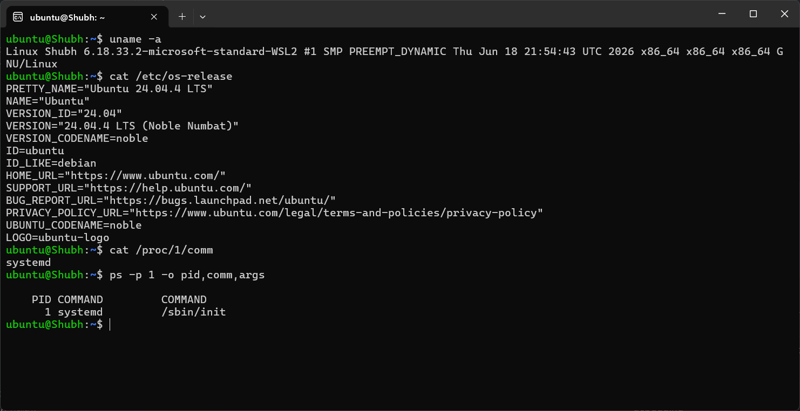

### 2. Process list (`ps -ef`, `ps aux --sort=-%cpu`)
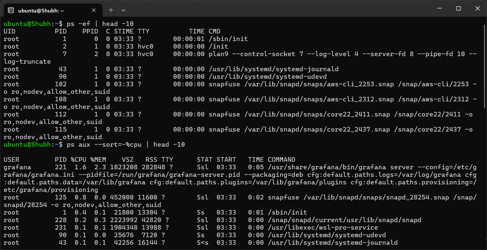

### 3. Process tree + proc status (`pstree -p`, `/proc/221/status`)
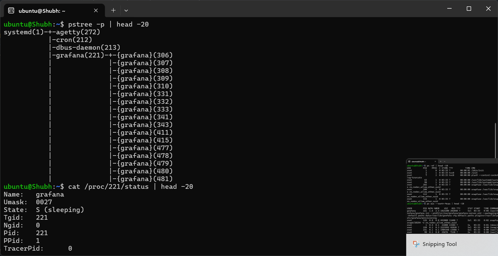

### 4. Process snapshot + live view (`ps aux`, `top -b -n 1`)
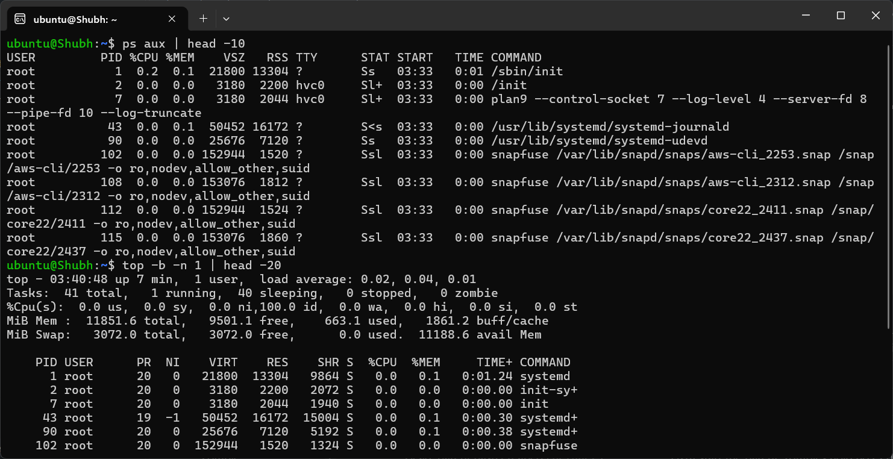

### 5. Process state of PID 1 (`ps -o pid,stat,comm -p 1` → `Ss systemd`)
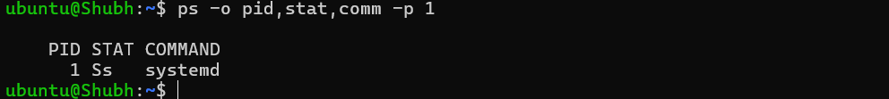

### 6. systemd journal service status (part)
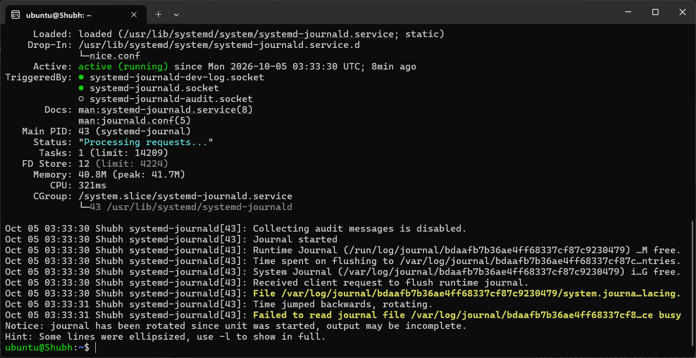

### 7. Running services (`systemctl list-units --type=service --state=running`)
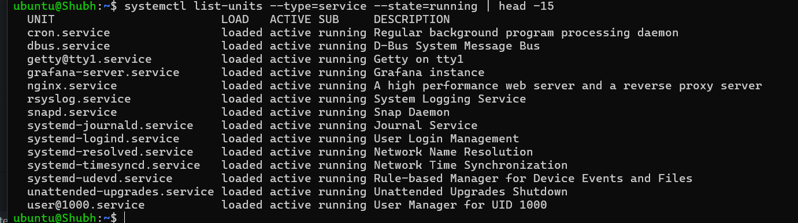

### 8. Troubleshooting: `ssh.service` not-found + empty journal before openssh install
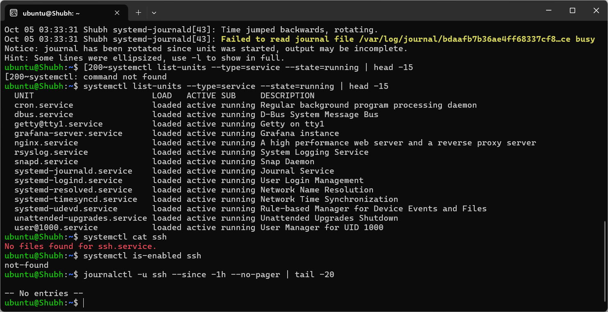

### 9. Unit file anatomy (`systemctl cat ssh`)
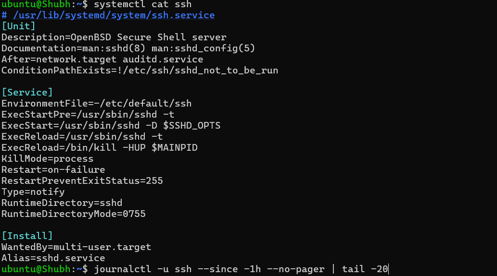

### 10. systemd journal service status (full — `active (running)`)
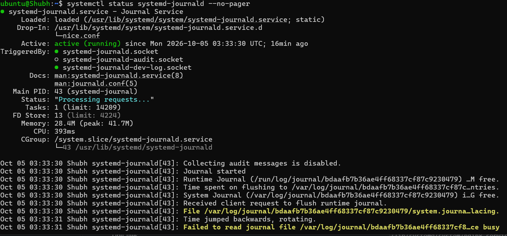

### 11. Fix: `systemctl enable --now ssh` + `journalctl -u ssh` shows `Server listening on 0.0.0.0 port 22`
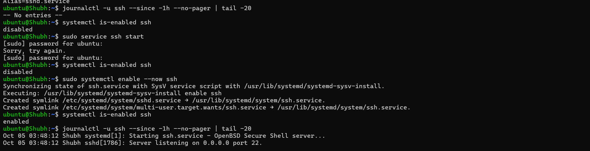

### 12. Unit before/after: `not-found` → real `/usr/lib/systemd/system/ssh.service` after install
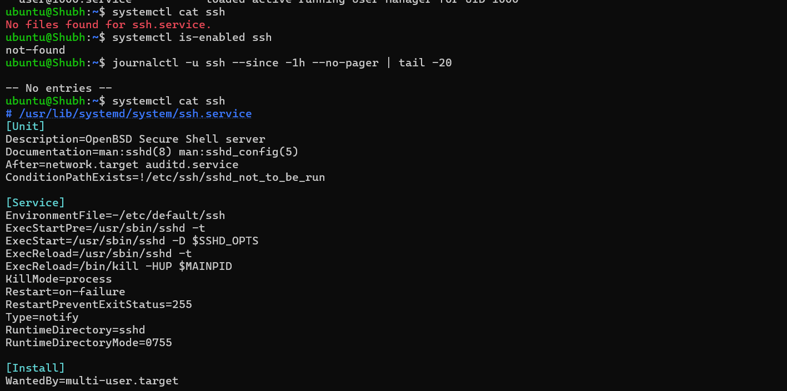

### 13. Prerequisite fix: `sudo apt update` + `sudo apt install openssh-server -y`
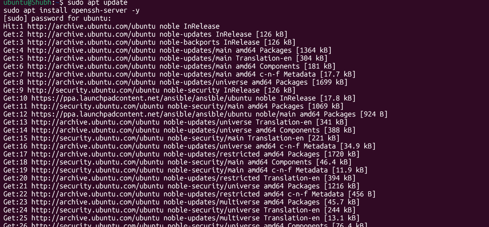
