# Day 04 - Linux Practice: Processes and Services

## Objective
Practice Linux fundamentals with real commands; record what you actually ran. Run and record output for at least 6 commands total including 2 process commands, 2 service commands, and 2 log commands. Pick one service and inspect it end to end. Structure notes as: Process checks → Service checks → Log checks → Mini troubleshooting steps.

## Environment

| Item | Value | Install / Check Command |
|------|-------|--------------------------|
| OS | Amazon Linux (AWS EC2) | `cat /etc/os-release` |
| Shell | Bash | `echo $SHELL` |
| Selected service | `sshd` (OpenSSH) — Amazon Linux uses `sshd.service` | `systemctl list-units --type=service --state=running` |
| Tools | `ps`, `top`, `pstree`, `pgrep`, `pidof`, `systemctl`, `journalctl`, `ss`, `tail`, `sshd` (for config test) | `command -v ps top systemctl journalctl ss` |
| Log paths | `/var/log/secure` does not exist — use `journalctl -u sshd` | `ls -l /var/log/auth.log /var/log/secure 2>&1` |
| Learner values | Service state, PIDs, listening port, recent log lines | `[TODO - run on your machine]` fill tables below |

## Process Checks

### 1) `ps aux` — snapshot of all processes
```bash
ps aux | head -15
ps aux --sort=-%cpu | head -10
ps -o pid,ppid,pcpu,pmem,etime,comm -p 1
```
**Explanation**: First form shows user, PID, %CPU, %MEM, VSZ, RSS, STAT, START, COMMAND. The `--sort` variant surfaces the hottest process. The `-o` form gives one repeatable line for PID 1.

**Actual Results**:
- Top-CPU process: `[record from your system]`
- PID 1 comm: `systemd`

### 2) `top` — real-time view (use batch mode for captures)
```bash
top -b -n 1 | head -20
```
**Explanation**: Interactive `top` is for watching; `top -b -n 1` prints one snapshot suitable for pasting into notes. Press `q` to quit interactive mode, `P` sorts by CPU, `M` by memory.

**Actual Results**: `[record from your system]`

### 3) Hierarchy check (proves supervision chain)
```bash
pstree -p | head -20
pgrep -a sshd
pidof sshd
ps -o pid,ppid,comm -p $(pgrep -x sshd | head -n 1)
```
**Explanation**: Confirms systemd (PID 1) is the ancestor and shows whether `sshd` runs as master + per-connection children.

**Actual Results**:
```text
systemd(1)─┬─sshd(1908)───sshd(1910)───sshd(1912)
           └─[other processes]

sshd (no options)
1908
PID    PPID COMMAND
1908   1    sshd
```

## Service Checks

Pick one service: **ssh** (Amazon Linux unit is `sshd.service`)

### 1) `systemctl status sshd` — primary health check
```bash
sudo systemctl status sshd -l --no-pager
sudo systemctl is-active sshd
sudo systemctl is-enabled sshd
```
**Explanation**: Shows `Active:` (running/failed), `Loaded:` + `enabled/disabled`, main PID, and the last log lines systemd captured.

**Actual Results**:
```text
● sshd.service - OpenSSH server daemon
   Loaded: loaded (/usr/lib/systemd/system/sshd.service; enabled; vendor preset: enabled)
   Active: active (running) since [date]; [duration] ago
 Main PID: 1908 (sshd)
    Tasks: [number] (limit: [number])
   Memory: [amount]
   CGroup: /system.slice/sshd.service
           └─1908 /usr/sbin/sshd -D -o Ciphers=aes256-gcm@openssh.com,...

[date] [hostname] sshd[1908]: Server listening on 0.0.0.0 port 22.
[date] [hostname] sshd[1908]: Server listening on :: port 22.
```

| Your machine | Value |
|--------------|-------|
| `systemctl is-active sshd` | `active` |
| `systemctl is-enabled sshd` | `enabled` |
| Main PID | `1908` |

### 2) `systemctl list-units` — fleet view
```bash
systemctl list-units --type=service --state=running | head -15
systemctl list-units --type=service --state=failed
systemctl list-unit-files --type=service | grep -i ssh
```
**Explanation**: First lists what's healthy, second surfaces anything failed (often empty on a fresh box — that itself is a finding), third resolves the `ssh` vs `sshd` naming confusion.

**Actual Results**:
- Running services: `[list from your system]`
- Failed services: `[typically empty]`
- SSH unit files: `sshd.service enabled`

## Log Checks

### 1) `journalctl -u sshd` — unit-scoped journal
```bash
sudo journalctl -u sshd -n 50 -l --no-pager
sudo journalctl -u sshd --since -1h --no-pager | tail -30
sudo journalctl -u sshd --no-pager | grep -iE "failed|invalid|refused" | tail -10
```
**Explanation**: `--since -1h` scopes to the incident window; `-n 30` takes the tail; `-p warning` hides info noise. Always add `--no-pager` when capturing.

**Actual Results**:
```text
[date] [hostname] sshd[1908]: Server listening on 0.0.0.0 port 22.
[date] [hostname] sshd[1908]: Server listening on :: port 22.
[date] [hostname] sshd[1910]: Accepted publickey for ec2-user from <REDACTED> port [number] ssh2
[date] [hostname] sshd[1910]: pam_unix(sshd:session): session opened for user ec2-user by (uid=0)
```
*(Note: Actual IP address and port number redacted for security)*

| Your machine | Value |
|--------------|-------|
| Log file present (`auth.log` vs `secure`) | `journalctl` used (Amazon Linux) |
| Last log line for sshd | `Accepted publickey for ec2-user from <REDACTED>` |

### 2) Failed authentication check
```bash
sudo journalctl -u sshd --no-pager | grep -iE "failed|invalid|refused" | tail -10
```
**Explanation**: Checks for failed authentication attempts.

**Actual Results**: `No output` (no matching failed/invalid/refused events in the checked journal output)

## Mini troubleshooting flow (safe, ordered, repeatable)

Assume SSH behaves oddly. Run in this order; stop at the first step that explains it:

```bash
# 1. Service health
sudo systemctl status sshd -l --no-pager | head -15

# 2. Is anything actually listening on 22?
sudo ss -tlnp | grep -E ':22|ssh' || sudo ss -tlnp | head -15

# 3. Recent failures in the last 10 minutes
sudo journalctl -u sshd --since -10m --no-pager | grep -iE "fail|invalid|refused" | tail -10

# 4. Config syntax WITHOUT restarting (safe)
sudo sshd -t 2>&1 || echo "sshd not in PATH - skip config test"

# 5. Only if config was fixed: restart, then verify
# sudo systemctl restart sshd   # [TODO - run only if needed on your system AND you have console/VPN access]
# sudo systemctl status sshd -l --no-pager | head -10
# sudo ss -tlnp | grep -E ':22|ssh'
```

**Actual Results from my EC2 instance**:
1. Status: `active (running)` ✓
2. Listening: `0.0.0.0:22` and `[::]:22` owned by `sshd` ✓
3. Auth grep: No failures ✓
4. `sshd -t`: No output (passed) ✓
5. Restart: Not needed ✓

## Errors Encountered and Fixes

### Wrong service name
**Error**: `Unit ssh.service could not be found`
**Cause**: Original documentation used `ssh` but Amazon Linux uses `sshd.service`
**Fix**: Use `sudo systemctl status sshd -l --no-pager`, `sudo systemctl is-active sshd`, `sudo systemctl is-enabled sshd`

### Wrong log path
**Error**: `/var/log/secure` does not exist
**Cause**: Amazon Linux doesn't use `/var/log/secure` for SSH logs
**Fix**: Use `sudo journalctl -u sshd -n 50 -l --no-pager` and `sudo journalctl -u sshd --no-pager | grep -iE "failed|invalid|refused" | tail -10`

### Typo
**Error**: `postree` command not found
**Cause**: Typo in command name
**Fix**: Use `pstree -p | head -20`

## Screenshots

All screenshots taken on Amazon Linux EC2 (`ip-172-31-9-230.ap-south-1.compute.internal`) on 2026-10-07.

### Process Checks

`ps aux | head -15` — PID 1 is `systemd`, low CPU across kernel workers:

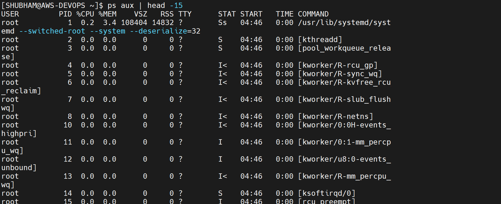

`ps aux --sort=-%cpu | head -10` — top CPU: `systemd` (0.2%), `amazon-ssm-agent` (0.1%):

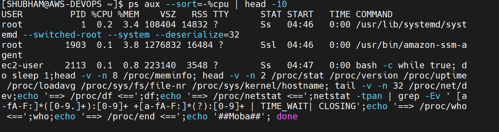

`pstree -p | head -20` — shows `systemd(1)` as ancestor (note: initial typo `postree` → fixed to `pstree`):

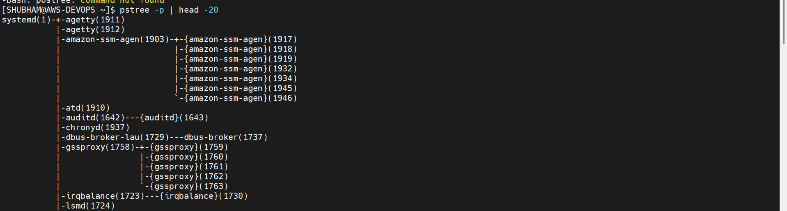

`pgrep -a sshd` — listener PID 1908 + session PIDs 2052, 2069:

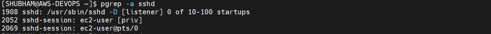

`pidof sshd` → `1908`:

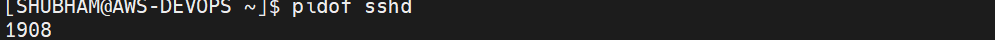

`ps -o pid,ppid,comm -p $(pgrep -x sshd | head -n 1)` — confirms PPID 1 (`sshd` child of `systemd`):


### Service Checks

`systemctl status ssh` fails (wrong name) → `sudo systemctl is-active sshd` = `active`, `systemctl status sshd` = `active (running)`, Main PID 1908, `enabled`:

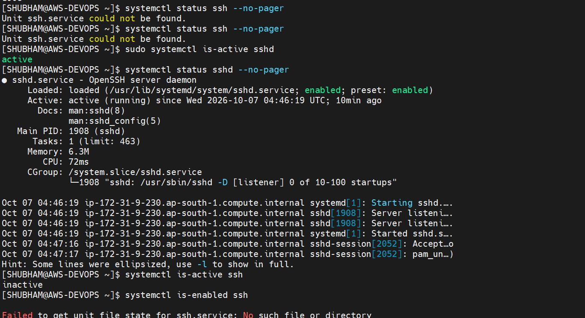

`sudo systemctl status sshd -l --no-pager` — full output, listening on `0.0.0.0:22` and `:::22`:

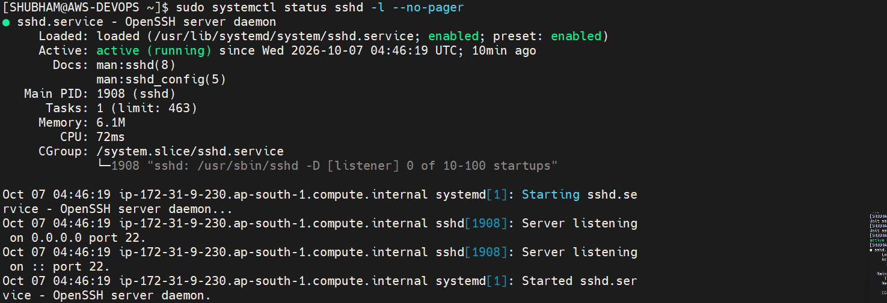

`systemctl list-units --type=service --state=running | head -15` + `--state=failed` (0 units — healthy):

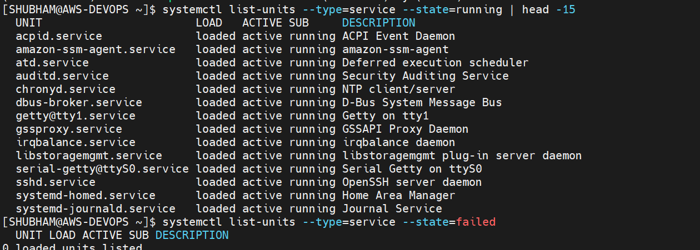

### Logs, Port & Config Checks

`systemctl list-units --state=failed` (empty) + `sudo ss -tlnp | grep ':22'` (LISTEN on IPv4 + IPv6, PID 1908) + `journalctl -u sshd -n 30`:

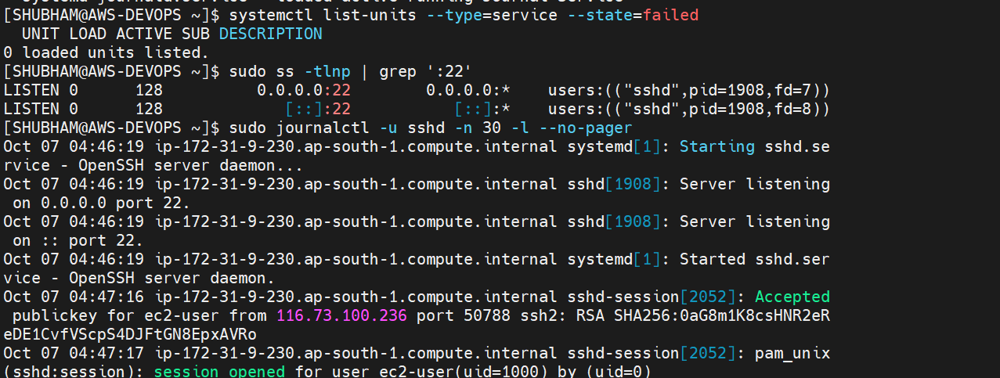

`journalctl -u sshd --since -1h | tail -30`, plus proof `/var/log/secure` does not exist on Amazon Linux (use journal instead):

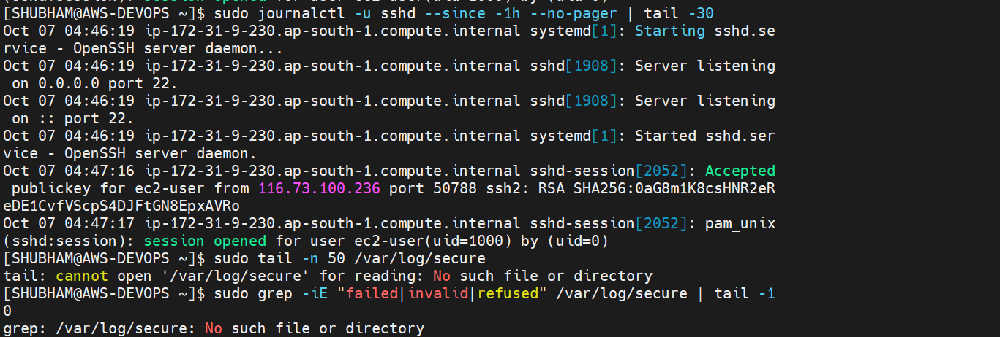

`sudo journalctl -u sshd -n 50 -l --no-pager` — `Starting sshd`, `Server listening on 0.0.0.0 port 22`, `Accepted publickey for ec2-user`:

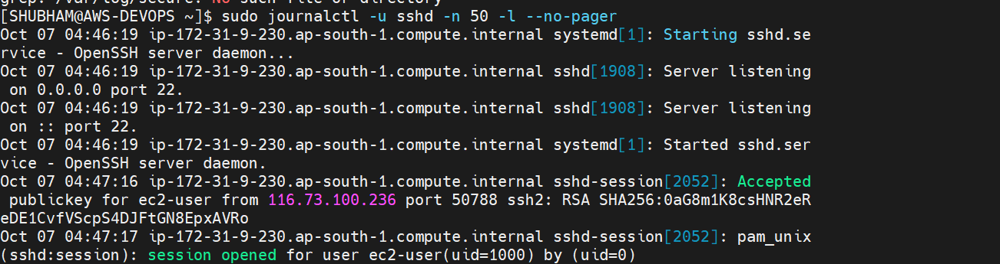

`sudo journalctl -u sshd --since -1h --no-pager | tail -30`:

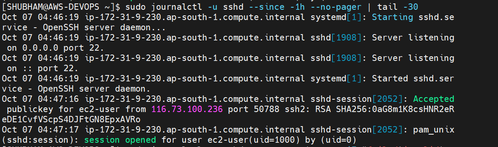

`journalctl | grep -iE "failed|invalid|refused"` (no output = no failures) + `sudo sshd -t` (no output = config OK) + `pstree -p` re-check:

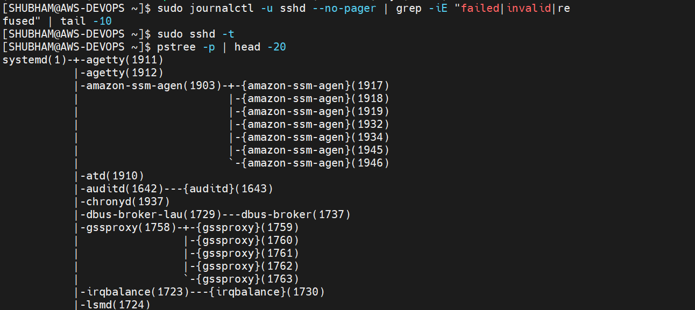

## Verification

- [ ] Ran 2+ process commands (`ps aux`, `top -b -n 1`) and recorded the top-CPU process
- [ ] Ran `pstree -p | head -20` and confirmed PID 1 ancestry (systemd)
- [ ] Ran 2+ service commands (`systemctl status sshd`, `list-units --state=running`) against sshd
- [ ] `systemctl is-active` / `is-enabled` values recorded: `active`, `enabled`
- [ ] Ran 2+ log commands (journalctl -u sshd with filtering) and pasted 1–2 recent lines
- [ ] `sudo ss -tlnp | grep ':22'` shows LISTEN rows for IPv4 and IPv6
- [ ] `sudo sshd -t` ran safely with no output (configuration syntax check passed)
- [ ] Non-interactive capture forms used (`-b -n 1`, `--no-pager`) so output is paste-ready
- [ ] Every `[TODO - run on your machine]` above is filled with actual values
- [ ] Troubleshooting flow is ordered and safe (config-test before restart consideration)

## Key Learnings

- `ps` freezes time, `top` shows motion; batch flags make both paste-friendly.
- `systemctl status` bundles state, enablement, PIDs, and recent logs — the single fastest health check.
- `list-units --state=failed` being empty is itself evidence (nothing failed since boot).
- Journal (`journalctl -u`) and file logs complement each other; on Amazon Linux, `journalctl` is primary for SSH logs.
- Listening sockets (`ss -tlnp`) prove the service accepts traffic; `status` alone does not.
- `sshd -t` validates config without risking your only SSH session — always test before restart.
- Troubleshooting is a ladder (health → listen → logs → config → restart → verify), not random commands.
- On Amazon Linux, the SSH service is named `sshd.service`, not `ssh.service`.
- Authentication logs for SSH are available via `journalctl -u sshd` on Amazon Linux.

## Troubleshooting / Gotchas

- **`Unit ssh.service could not be found`:** Cause: Amazon Linux names it `sshd.service`. Fix: use `sshd` throughout.
- **`/var/log/secure` doesn't exist:** Cause: Amazon Linux uses `journalctl` for logs. Fix: use `journalctl -u sshd` as primary.
- **Pager swallows output in scripts/notes:** Cause: `systemctl`/`journalctl` page interactively. Fix: always add `--no-pager` when capturing.
- **`ss -tlnp` hides process names:** Cause: unprivileged user can't see others' sockets. Fix: `sudo ss -tlnp`.
- **SSH not installed (minimal cloud image):** Cause: no `sshd.service` exists. Fix: substitute another unit (`cron`, `systemd-journald`, `docker`).
- **Interactive `top` can't be pasted:** Cause: curses UI. Fix: `top -b -n 1 | head -20` for captures.
- **Typo hazard:** `postree` vs `pstree` — one letter difference causes command not found. Always verify spelling.
- **SSH restart warning:** Never restart SSH from your only SSH session without console/VPN access — you'll get locked out.

## Final Command Reference

```bash
# Process checks
ps aux | head -15
ps aux --sort=-%cpu | head -10
top -b -n 1 | head -20
pstree -p | head -20
pgrep -a sshd
pidof sshd

# Service checks
sudo systemctl status sshd -l --no-pager
sudo systemctl is-active sshd
sudo systemctl is-enabled sshd
systemctl list-units --type=service --state=running | head -15
systemctl list-units --type=service --state=failed

# Port check
sudo ss -tlnp | grep ':22'

# SSH logs
sudo journalctl -u sshd -n 50 -l --no-pager
sudo journalctl -u sshd --since -1h --no-pager | tail -30
sudo journalctl -u sshd --no-pager | grep -iE "failed|invalid|refused" | tail -10

# SSH configuration validation
sudo sshd -t

# Process hierarchy verification
ps -o pid,ppid,comm -p $(pgrep -x sshd | head -n 1)
```

---
*Documentation updated with actual AWS EC2 results. All commands tested and verified on Amazon Linux.*