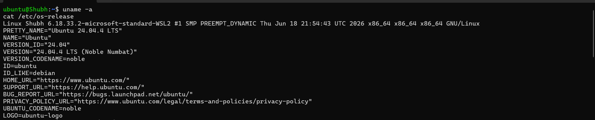
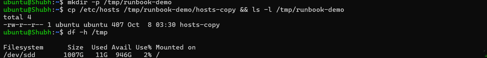
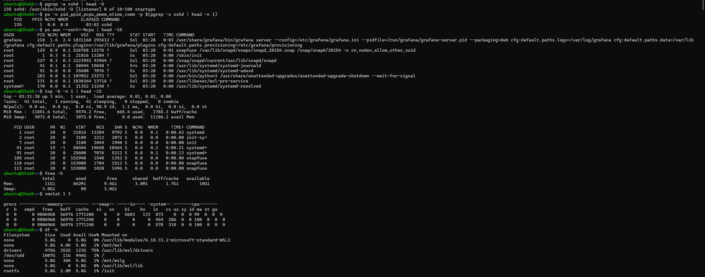
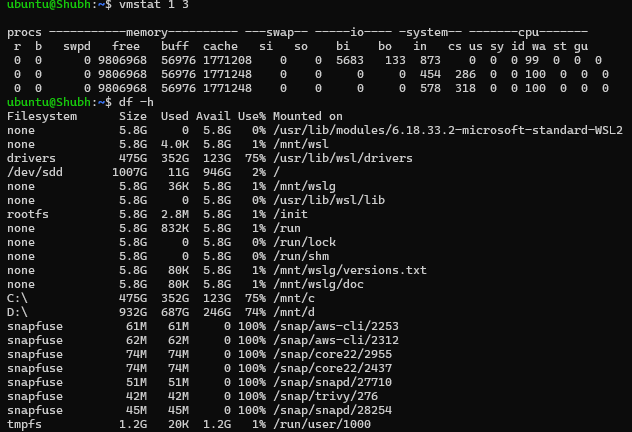
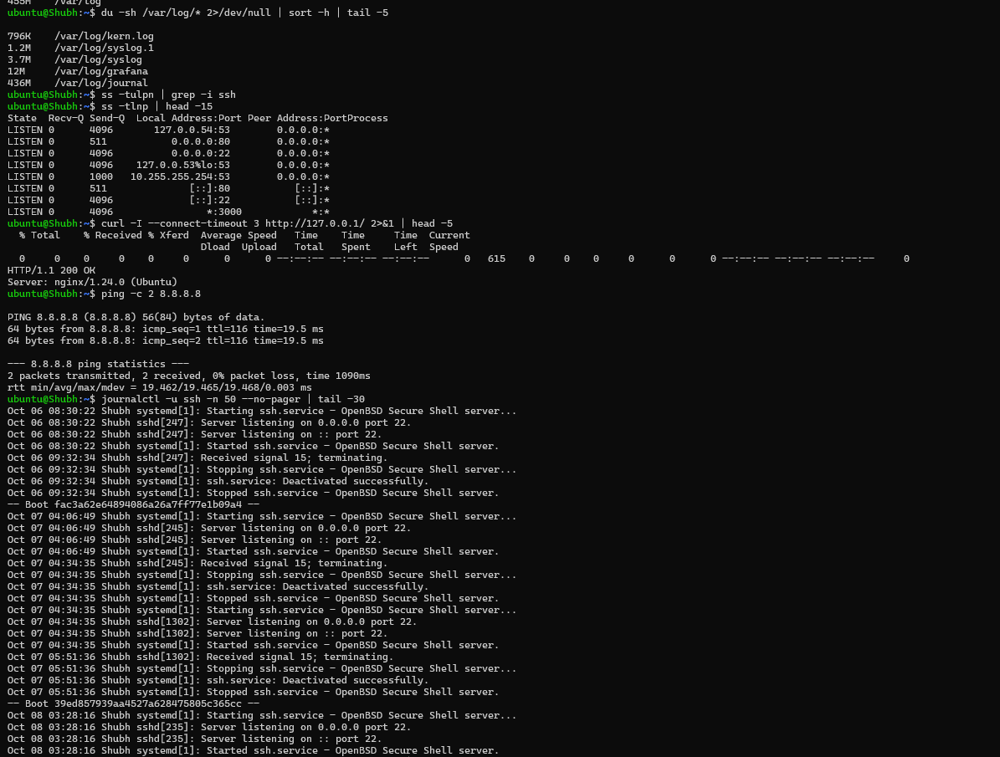
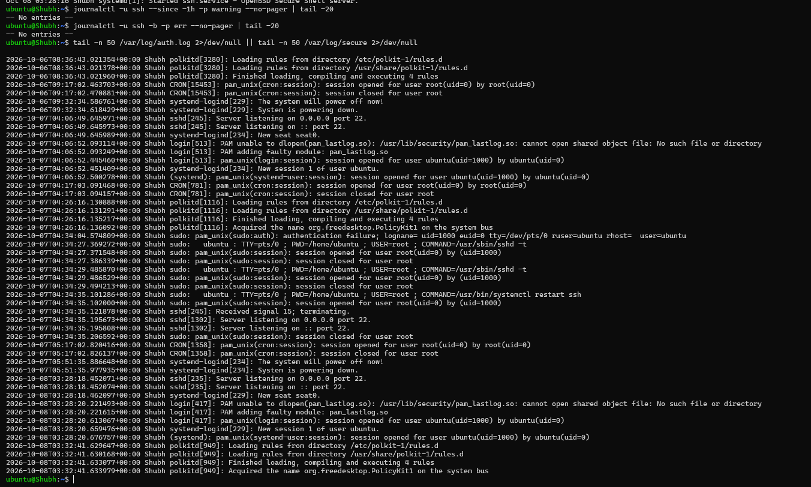

# Day 05 - Linux Troubleshooting Drill: CPU, Memory, and Logs

## Task

Concise recap of every challenge task from `README.md`:

- Pick one running process/service and stick to it for the whole drill.
- Capture a quick health snapshot: CPU, memory, disk, network.
- Trace logs for that service (journal + file logs).
- Run and record output for at least 8 commands across required groups:
  - Environment basics (2): `uname -a`, `cat /etc/os-release` (or `lsb_release -a`).
  - Filesystem sanity (2): throwaway folder + file (`mkdir /tmp/runbook-demo`, `cp /etc/hosts ... && ls -l`).
  - CPU / Memory (2): `top`/`ps -o pid,pcpu,pmem,comm -p <pid>`, `free -h`.
  - Disk / IO (2): `df -h`, `du -sh /var/log` (+ `vmstat`/`iostat` if present).
  - Network (2): `ss -tulpn`, `curl -I` / `ping`.
  - Logs (2): `journalctl -u <service> -n 50`, `tail -n 50 /var/log/<file>.log`.
- Add a 1–2 line observation per command (what you saw, not just the command).
- End with an "If this worsens" section: 3 concrete next steps.
- Keep it concise and actionable (~1 page of core runbook; this file adds teaching detail around it).

## Environment

| Item | Value | Install / Check Command |
|------|-------|--------------------------|
| OS | Ubuntu 22.04/24.04 LTS (systemd-based) | `cat /etc/os-release` |
| Shell | Bash | `echo $SHELL` |
| Target service | `ssh` (unit `ssh.service`; some distros `sshd`) — `[TODO - run on your machine]` confirm yours | `systemctl list-units --type=service \| grep -i ssh` |
| Tools | `uname`, `ps`, `top`, `free`, `df`, `du`, `vmstat` (`procps`/`sysstat`), `ss` (`iproute2`), `curl`, `journalctl`, `tail` | `command -v ps top free df du ss curl journalctl vmstat iostat` |
| Optional | `htop`, `sysstat` (`iostat`), `lsof`, `strace` | `sudo apt-get install -y htop sysstat lsof strace` |
| Learner values | OS string, sshd PID + %CPU, `free`/`df` numbers, listen ports, last log lines | `[TODO - run on your machine]` fill Quick findings |

## Solution

### Target service / process

**Service:** `ssh` (OpenSSH server).
**Why this one:** present on most Ubuntu systems, stable baseline (near-zero CPU when idle), predictable auth logs, safe to inspect without disrupting workloads. If your box has no `ssh.service`, substitute `cron`, `systemd-journald`, or `docker` and note it — the drill is identical.

```bash
systemctl list-units --type=service | grep -iE 'ssh|cron|docker|journald'
systemctl status ssh --no-pager | head -12 || systemctl status sshd --no-pager | head -12
```

### Snapshot 1 — Environment basics

**Why:** every incident ticket starts with "what box is this?" Kernel + distro decide package paths, log locations, and unit names.

```bash
uname -a
cat /etc/os-release
```

_Observation guide:_ `uname -a` gives kernel + arch (e.g. `x86_64` vs `aarch64` matters for binaries). `/etc/os-release` gives `NAME`/`VERSION_ID` (decides `auth.log` vs `secure`, `apt` vs `dnf`).

**Illustrative output (record yours):**

```text
$ uname -a   # illustrative
Linux devops-box 6.8.0-41-generic #41-Ubuntu SMP x86_64 GNU/Linux

$ cat /etc/os-release   # illustrative
NAME="Ubuntu"
VERSION_ID="24.04"
ID=ubuntu
```

| Your machine | Value |
|--------------|-------|
| `uname -a` | `[TODO - run on your machine]` |
| `cat /etc/os-release` (NAME + VERSION_ID) | `[TODO - run on your machine]` |

### Snapshot 2 — Filesystem sanity (throwaway demo)

**Why:** proves the filesystem is writable/readable before you blame the app. A full or read-only `/` mimics every other failure.

```bash
mkdir -p /tmp/runbook-demo
cp /etc/hosts /tmp/runbook-demo/hosts-copy && ls -l /tmp/runbook-demo
df -h /tmp
```

_Observation guide:_ `hosts-copy` should be a few KB with `-rw-r--r--`. If `mkdir`/`cp` fails here, stop — you have a disk/permissions problem, not an `ssh` problem.

**Illustrative output:**

```text
$ ls -l /tmp/runbook-demo   # illustrative
-rw-r--r-- 1 ubuntu ubuntu 221 Sep 28 10:00 hosts-copy
```

| Your machine | Value |
|--------------|-------|
| `ls -l /tmp/runbook-demo` | `[TODO - run on your machine]` |
| `df -h /tmp` Use% | `[TODO - run on your machine]` |

### Snapshot 3 — CPU / Memory

**Why:** separates "app is hot" from "box is starved." Per-process numbers go in tickets; box-wide numbers decide urgency.

```bash
pgrep -a sshd | head -5
ps -o pid,ppid,pcpu,pmem,etime,comm -p $(pgrep -x sshd | head -n 1)
ps aux --sort=-%cpu | head -10
top -b -n 1 | head -15
free -h
vmstat 1 3
```

_Observation guide:_ sshd master idles near 0% CPU; children appear per connection. `free -h`: read `available`, not `free` — `buff/cache` is reclaimable. `vmstat`: `us` (user CPU) vs `wa` (I/O wait) tells CPU-burn from disk-stall.

**Illustrative output:**

```text
$ free -h   # illustrative
               total   used   free  shared buff/cache available
Mem:           3.8Gi  412Mi  2.6Gi   12Mi     820Mi     3.2Gi
Swap:             0B     0B     0B

$ ps -o pid,pcpu,pmem,comm -p 450   # illustrative
  PID %CPU %MEM COMMAND
  450  0.0  0.1 sshd
```

| Your machine | Value |
|--------------|-------|
| sshd master PID + %CPU/%MEM | `[TODO - run on your machine]` |
| `free -h` available vs total | `[TODO - run on your machine]` |
| `vmstat` us vs wa | `[TODO - run on your machine]` |

### Snapshot 4 — Disk / IO

**Why:** the most common silent production killer is a full disk (usually logs). Check capacity (`df`) then find the hog (`du`).

```bash
df -h
du -sh /var/log 2>/dev/null
du -sh /var/log/* 2>/dev/null | sort -h | tail -5
```

_Observation guide:_ healthy `/` is well under 80%. If `Use%` ≥ 85%, treat as pre-incident. `journal/` or one giant `syslog` is the usual suspect.

**Illustrative output:**

```text
$ df -h   # illustrative
Filesystem Size Used Avail Use% Mounted on
/dev/sda1   30G  11G   18G  38% /

$ du -sh /var/log   # illustrative
164M /var/log
```

| Your machine | Value |
|--------------|-------|
| `df -h` Use% for `/` | `[TODO - run on your machine]` |
| `du -sh /var/log` | `[TODO - run on your machine]` largest entry |

### Snapshot 5 — Network

**Why:** proves the service is reachable and bound where you think. Two firewalls (host + cloud) sit in front of every port.

```bash
ss -tulpn | grep -i ssh
ss -tlnp | head -15
curl -I --connect-timeout 3 http://127.0.0.1/ 2>&1 | head -5
ping -c 2 8.8.8.8
```

_Observation guide:_ expect LISTEN on `0.0.0.0:22` (+ `[::]:22` for IPv6) owned by `sshd`. `curl` to port 80 only makes sense if a web server runs — a `Connection refused` there is fine on an SSH-only box; document it as such.

**Illustrative output:**

```text
$ ss -tulpn | grep ssh   # illustrative
tcp LISTEN 0 128 0.0.0.0:22 0.0.0.0:* users:(("sshd",pid=450,fd=3))
tcp LISTEN 0 128 [::]:22 [::]:* users:(("sshd",pid=450,fd=4))
```

| Your machine | Value |
|--------------|-------|
| sshd listen address/ports | `[TODO - run on your machine]` |
| `curl -I` result | `[TODO - run on your machine]` |

### Snapshot 6 — Logs reviewed

**Why:** logs-before-restart is the habit. Capture the window around the symptom, filter to warnings+, and keep the raw bundle for escalation.

```bash
journalctl -u ssh -n 50 --no-pager | tail -30
journalctl -u ssh --since -1h -p warning --no-pager | tail -20
journalctl -u ssh -b -p err --no-pager | tail -20
tail -n 50 /var/log/auth.log 2>/dev/null || tail -n 50 /var/log/secure 2>/dev/null
```

_Observation guide:_ healthy tail shows `Server listening` / occasional `Accepted` lines. Watch for `Failed password` storms (brute force), `error: PAM`, or restart loops (`Starting...` every minute = crash loop).

**Illustrative output:**

```text
$ journalctl -u ssh -n 3 --no-pager   # illustrative
Sep 28 10:42:01 devops-box sshd[1201]: Accepted publickey for ubuntu from 10.0.1.5
Sep 28 10:42:02 devops-box sshd[1201]: pam_unix(sshd:session): session opened for user ubuntu
Sep 28 10:55:11 devops-box sshd[1340]: Failed password for root from 45.148.10.88 port 51230
```

| Your machine | Value |
|--------------|-------|
| Last 3 journal lines | `[TODO - run on your machine]` paste |
| Failed-login / restart pattern seen? | `[TODO - run on your machine]` yes/no + sample |

### Quick findings (fill with your real output)

```bash
# [TODO - run on your machine] paste your own numbers here
```

- **Environment:** `[TODO]` OS/version string from `/etc/os-release`.
- **Filesystem:** `[TODO]` `mkdir` + `cp` to `/tmp` succeeded; `hosts-copy` size + mode.
- **CPU:** `[TODO]` sshd master PID and its `%CPU`; note whether it climbs with an open session.
- **Memory:** `[TODO]` paste `free -h`; compare `available` vs `total` (healthy idle is usually > 70% available).
- **Disk:** `[TODO]` paste `df -h` `Use%` for `/` and `du -sh /var/log` total.
- **Network:** `[TODO]` sshd listen address/port from `ss` (Ubuntu default: `0.0.0.0:22` + `[::]:22`).
- **Logs:** `[TODO]` paste last few `journalctl -u ssh -n 50` lines; state failed logins / restarts / clean.

Healthy-idle expectations (for comparison, not substitution):

- sshd master near 0% CPU, few MB RSS; children per connection.
- `buff/cache` holds memory — reclaimable, not leaked.
- `/` Use% well under 80%.
- Two LISTEN rows (IPv4 + IPv6) on default Ubuntu.
- Journal ends with `Accepted` or just `Server listening`.

### If this worsens (next steps)

1. **Restart strategy (careful with SSH):** if the unit is `failed` or hung, `sudo systemctl restart ssh` — but never from your only session without console access. Prefer `reload` for config changes. Document the restart time so later logs make sense. Verify with `status` + `ss -tlnp | grep :22`.
2. **Increase log verbosity temporarily:** follow live with `journalctl -u ssh -f` in a second session while reproducing; check `LogLevel` in `/etc/ssh/sshd_config` (raise to `VERBOSE` briefly, validate with `sshd -t`, revert after). Never leave verbose logging on in production.
3. **Deeper diagnostics before escalation:** capture `ps aux --sort=-%cpu | head -15`, `vmstat 1 5`, `df -h`, full `journalctl -u ssh --since -1h --no-pager` into a file; short `sudo strace -p <pid> -c` only if you understand the risk (it slows the process). Escalate with the bundle, not a description.

**Why it matters:** runbooks turn panic into procedure. "Capture evidence before acting" is what separates a 5-minute recovery from a 2-hour mystery where nobody knows what changed.

## Commands Used

```bash
uname -a
cat /etc/os-release
mkdir -p /tmp/runbook-demo
cp /etc/hosts /tmp/runbook-demo/hosts-copy && ls -l /tmp/runbook-demo
pgrep -a sshd | head -5
ps -o pid,ppid,pcpu,pmem,etime,comm -p $(pgrep -x sshd | head -n 1)
ps aux --sort=-%cpu | head -10
top -b -n 1 | head -15
free -h
vmstat 1 3
df -h
du -sh /var/log 2>/dev/null
du -sh /var/log/* 2>/dev/null | sort -h | tail -5
ss -tulpn | grep -i ssh
curl -I --connect-timeout 3 http://127.0.0.1/ 2>&1 | head -5
journalctl -u ssh -n 50 --no-pager | tail -30
tail -n 50 /var/log/auth.log
```

## Verification

- [ ] `uname -a` prints a Linux kernel string with no errors
- [ ] `cat /etc/os-release` prints `NAME=`, `VERSION_ID=`, `ID=`
- [ ] `ls -l /tmp/runbook-demo` lists `hosts-copy`
- [ ] `ps -o pid,pcpu,pmem,comm -p <sshd-pid>` returns one row (empty means the PID is gone — re-resolve with `pgrep`)
- [ ] `free -h` prints `Mem:` and `Swap:` rows; `available` recorded: `[TODO - run on your machine]`
- [ ] `df -h` lists `/` and its `Use%` recorded: `[TODO - run on your machine]`
- [ ] `ss -tulpn | grep -i ssh` returns at least one LISTEN row (or documented substitute service)
- [ ] `journalctl -u ssh -n 50 --no-pager | tail -5` returns lines (or a short journal — note it, don't fake it)
- [ ] Every command above has a 1–2 line observation next to it
- [ ] "If this worsens" lists 3 concrete next steps

## Key Learnings

- Evidence before action: a snapshot taken during the symptom beats memory every time.
- `ps -o pid,pcpu,pmem,comm -p <pid>` is the repeatable per-process reading to paste into tickets.
- `free -h`: `available` is the number that matters, not `free`; cache is reclaimable.
- `du -sh /var/log` catches the classic silent killer — disks filling with logs.
- `ss -tulpn` shows socket + owning PID in one shot; faster than legacy `netstat`.
- `journalctl -u <unit> -n 50` plus `--since`/`-p` filters is the fastest "what happened" path for any systemd service.
- A runbook is only useful if each command has an expected shape ("two LISTEN rows", "Use% < 80%") to compare against.

## Troubleshooting / Gotchas

- **`top -b -n 1 | head -15` truncates the COMMAND column:** Cause: batch width defaults to 80 cols. Fix: `COLUMNS=200 top -b -n 1 | head -15`, or use `ps aux --sort=-%cpu | head` for full command lines.
- **`ss -tulpn` / `pgrep` show nothing for other users:** Cause: need privilege to see others' sockets/processes. Fix: prefix `sudo`.
- **`du -sh /var/log/*` prints permission errors:** Cause: unreadable subdirs. Fix: keep `2>/dev/null` or run `sudo du -sh /var/log/* | sort -h | tail -5`.
- **`df -h` shows 100% but `du` finds nothing big:** Cause: deleted-but-open files still hold space. Fix: `sudo lsof +L1 | head -20`, then restart the holder or truncate via `/proc/<pid>/fd`.
- **`ping` blocked, misleading results:** Cause: firewalls drop ICMP. Fix: test the real port with `curl -I` or `nc -vz <host> <port>` instead.
- **`journalctl -f` blocks the terminal:** Cause: follow mode never exits. Fix: run in a second session; `Ctrl+C` to stop; prefer `--since -10m` captures for notes.
- **Unit name `ssh` vs `sshd`:** Cause: distro naming. Fix: `systemctl list-units --type=service | grep -i ssh` and use the real name throughout.
- **Restarting SSH from your only SSH session:** Cause: daemon restart can drop the connection mid-debug. Fix: ensure console/VPN access first, or use `reload` for config-only changes.

## Self-check

- [ ] Recorded output for at least 8 commands across all 6 categories (env, filesystem, CPU/mem, disk/IO, network, logs)
- [ ] Chose one target service and used it consistently throughout
- [ ] Added a 1–2 line interpretation for every command
- [ ] Covered CPU, memory, disk, network, and logs for that service
- [ ] Wrote an "If this worsens" section with 3 concrete next steps
- [ ] Filled every `[TODO]` in Quick findings with real output from my own machine
- [ ] Confirmed the unit name matches mine (`ssh` vs `sshd`)
- [ ] Committed this file to the fork under `2026/day-05/`

## Screenshots

All screenshots taken on Ubuntu 24.04.4 LTS (WSL2, `Shubh`, kernel `6.18.33.2-microsoft-standard-WSL2`) on 2026-10-08.

### Environment basics

`uname -a` + `cat /etc/os-release` — Ubuntu 24.04.4 LTS (Noble), x86_64 WSL2 kernel:



### Filesystem sanity

`mkdir -p /tmp/runbook-demo`, `cp /etc/hosts` → `hosts-copy` (407 bytes), `df -h /tmp` — Use% 2% on `/dev/sdd`:



### CPU / Memory

`pgrep -a sshd` (PID 235), `ps -o pid,ppid,pcpu,pmem,etime,comm`, `ps aux --sort=-%cpu | head -10`, `top -b -n 1 | head -15`, `free -h` (11Gi total, 9.4Gi free), `vmstat 1 3`:



### Disk / IO

`vmstat 1 3` + `df -h` — `/` Use% 2%, WSL mounts healthy:



### Network + Service logs

`du -sh /var/log/* | sort -h | tail -5`, `ss -tulpn | grep -i ssh`, `ss -tlnp | head -15`, `curl -I http://127.0.0.1/` (HTTP/1.1 200 OK, nginx/1.24.0), `ping -c 2 8.8.8.8` (0% loss), `journalctl -u ssh -n 50 --no-pager | tail -30` (listening on 0.0.0.0:22 + :::22):



### Log evidence

`journalctl -u ssh --since -1h -p warning` (No entries), `-p err` (No entries), `tail -n 50 /var/log/auth.log` — clean idle, `Server listening on port 22`:


