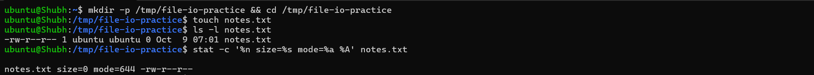
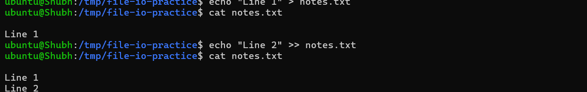
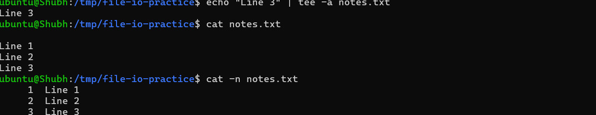
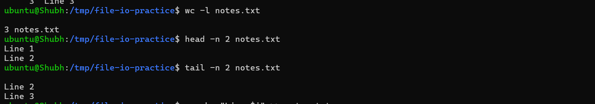
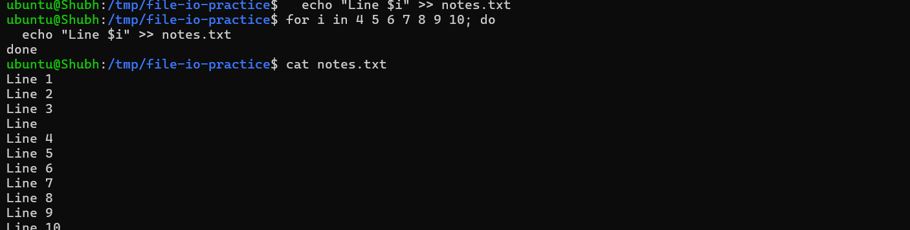
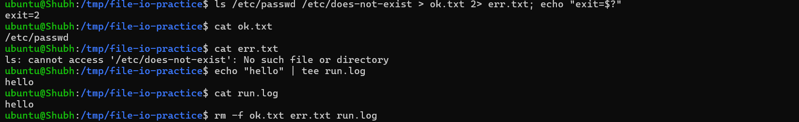

# Day 06 - Linux Fundamentals: Read and Write Text Files

## Objective
Practice Linux file read/write with basic commands only. Create `notes.txt`, write 3 lines with redirection, then read it back with `cat`, `head`, `tail`, and `tee`. Document every command and what it did.

## Environment

| Item | Value | Install / Check Command |
|------|-------|--------------------------|
| OS | Ubuntu 24.04.4 LTS (WSL2, kernel `6.18.33.2-microsoft-standard-WSL2`) | `cat /etc/os-release` |
| Shell | Bash (`/bin/bash`) | `echo $SHELL` |
| Working directory | `/tmp/file-io-practice` (writable scratch dir; use `~` on real runs, not `/mnt/c`) | `pwd` |
| Tools | `touch`, `echo`, `tee`, `cat`, `head`, `tail`, `wc`, `ls`, `stat` | `command -v touch echo tee cat head tail wc` |
| Companion file | `notes.txt` next to this note (10 lines, LF endings, 71 bytes) | `cat notes.txt` |

All outputs below verified on 2026-10-08 (WSL2 Ubuntu 24.04.4).

## File Checks

### 1) `touch notes.txt` — create empty file

```bash
mkdir -p /tmp/file-io-practice && cd /tmp/file-io-practice
touch notes.txt
ls -l notes.txt
stat -c '%n size=%s mode=%a %A' notes.txt
```

**Explanation**: `touch` creates the file if missing and only bumps timestamps if it exists — the safe "ensure it exists" primitive scripts use before appending.

**Actual Results**:
```text
-rw-r--r-- 1 ubuntu ubuntu 0 Oct  8 04:17 notes.txt
notes.txt size=0 mode=644 -rw-r--r--
```

Size `0`, mode `644`. Never truncates — safe to re-run.

### 2) `echo "Line 1" > notes.txt` — first write (truncate)

```bash
echo "Line 1" > notes.txt
cat notes.txt
```

**Explanation**: `>` redirects stdout into a file, creating it or emptying it first. Use for (re)generating a file from scratch.

**Actual Results**:
```text
Line 1
```

> Repeating `> notes.txt` after content exists destroys old content. That is the #1 beginner data-loss bug — use `>>` for every later line.

### 3) `echo "Line 2" >> notes.txt` — append

```bash
echo "Line 2" >> notes.txt
cat notes.txt
```

**Explanation**: `>>` seeks to end-of-file instead of truncating. Logs and multi-line configs are built with `>>`, never `>`.

**Actual Results**:
```text
Line 1
Line 2
```

| Operator | Behaviour | When to use |
|----------|-----------|-------------|
| `>` | Truncate then write | First line, regenerating a file |
| `>>` | Append to end | Every later line, log growth |
| `2>` | Redirect stderr only | Separate errors (`ls ok missing 2> err.txt`) |
| `2>&1` | Merge stderr into stdout | Capture everything (`cmd >> run.log 2>&1`) |

### 4) `echo "Line 3" | tee -a notes.txt` — write AND display

```bash
echo "Line 3" | tee -a notes.txt
cat notes.txt
```

**Explanation**: `tee` duplicates stdin to a file *and* to stdout, so you watch output live while saving it — the "run it and keep the receipt" pattern.

**Actual Results**:
```text
$ echo "Line 3" | tee -a notes.txt
Line 3
$ cat notes.txt
Line 1
Line 2
Line 3
```

First `Line 3` is `tee` echoing to the terminal; the three lines after are `cat` reading the file. That duplication proves write + display happened together.

| Form | Behaviour |
|------|-----------|
| `cmd \| tee file` | Write stdout to file (truncate) + show live |
| `cmd \| tee -a file` | Append + show live (what this task requires) |
| `cmd \| sudo tee /etc/config` | Write as root (bare `>` can't do this via `sudo`) |

Production version: `deploy.sh 2>&1 | tee deploy.log` — console for you, file for the postmortem.

### 5) `cat` — read the whole file

```bash
cat notes.txt
cat -n notes.txt
wc -l notes.txt
```

**Explanation**: `cat` dumps everything. Correct for 10-line files, wrong for 2 GB logs (use `head`/`less` there).

**Actual Results** (at 3-line stage):
```text
$ cat notes.txt
Line 1
Line 2
Line 3
$ cat -n notes.txt
     1	Line 1
     2	Line 2
     3	Line 3
$ wc -l notes.txt
3 notes.txt
```

### 6) `head` / `tail` — read file edges

```bash
head -n 2 notes.txt
tail -n 2 notes.txt
```

**Explanation**: Edges carry the most signal (headers, latest errors). `-n` controls line count.

**Actual Results**:
```text
$ head -n 2 notes.txt
Line 1
Line 2

$ tail -n 2 notes.txt
Line 2
Line 3
```

### 7) Extend to 10 lines (meets the 8–12 line guideline)

The README asks for 8–12 lines while the minimal flow produces 3. A loop with `>>` is the idiomatic safe builder:

```bash
for i in 4 5 6 7 8 9 10; do
  echo "Line $i" >> notes.txt
done
cat notes.txt
wc -l notes.txt
ls -l notes.txt
```

**Actual Results** (matches the companion `notes.txt` in this folder):
```text
Line 1
Line 2
Line 3
Line 4
Line 5
Line 6
Line 7
Line 8
Line 9
Line 10
10 notes.txt
-rw-r--r-- 1 ubuntu ubuntu 71 Oct  8 04:17 notes.txt
```

Final edges:
```text
$ head -n 2 notes.txt
Line 1
Line 2

$ tail -n 2 notes.txt
Line 9
Line 10
```

### 8) Two-stream patterns (stderr, combined logs)

Real commands produce two streams. Splitting or merging them deliberately keeps errors out of (or inside) your artifacts:

```bash
# stdout to one file, stderr to another
ls /etc/passwd /etc/does-not-exist > ok.txt 2> err.txt; echo "exit=$?"
cat ok.txt
cat err.txt

# live watch + save
echo "hello" | tee run.log
cat run.log
rm -f ok.txt err.txt run.log
```

**Actual Results**:
```text
exit=2
/etc/passwd
ls: cannot access '/etc/does-not-exist': No such file or directory
hello
hello
```

| Pattern | Meaning |
|---------|---------|
| `> file` | stdout → file (truncate) |
| `>> file` | stdout → file (append) |
| `2> file` | stderr → file |
| `2>&1` | stderr joins stdout (order matters — put it last) |
| `\| tee file` | stdout → file + terminal |

`cmd > out.log` alone hides errors; `cmd >> deploy.log 2>&1` survives audits.

## Commands Used

```bash
mkdir -p /tmp/file-io-practice && cd /tmp/file-io-practice
touch notes.txt
ls -l notes.txt
stat -c '%n size=%s mode=%a %A' notes.txt
echo "Line 1" > notes.txt
echo "Line 2" >> notes.txt
echo "Line 3" | tee -a notes.txt
cat notes.txt
cat -n notes.txt
head -n 2 notes.txt
tail -n 2 notes.txt
for i in 4 5 6 7 8 9 10; do echo "Line $i" >> notes.txt; done
wc -l notes.txt
ls -l notes.txt
ls /etc/passwd /etc/does-not-exist > ok.txt 2> err.txt; echo "exit=$?"
cat ok.txt
cat err.txt
echo "hello" | tee run.log
cat run.log
rm -f ok.txt err.txt run.log
```

## Verification

- `ls -l notes.txt` shows the file exists (0 bytes after `touch`, 71 bytes at 10 lines)
- `cat notes.txt` prints Lines 1–10 (matches companion `notes.txt` in this folder)
- `head -n 2 notes.txt` prints `Line 1` + `Line 2`
- `tail -n 2 notes.txt` prints `Line 9` + `Line 10`
- `wc -l notes.txt` prints `10 notes.txt`
- `tee -a` used once (Line 3) with terminal echo observed
- Line 1 written with `>`, Lines 2–10 appended with `>>` / `tee -a` (no accidental truncation)
- Step 8 `2>` / `2>&1` variants tried and `ok.txt`/`err.txt`/`run.log` understood then cleaned up
- `notes.txt` uses LF endings (`cat -A` shows `$`, no `^M$`)

## Key Learnings

- `>` truncates, `>>` appends — mixing them up silently destroys data; default to `>>` after the first write.
- `touch` never truncates; it only creates or refreshes timestamps, making it safe in scripts.
- `tee -a` is the "save it *and* show it" tool; `cmd 2>&1 | tee run.log` is the deploy-logging reflex.
- `> file` captures stdout only; errors need `2>` or `2>&1` or they vanish from your artifact.
- `head`/`tail -n` inspect multi-GB logs without freezing an editor; `cat` is for small files.
- Quoting (`"Line $i"` vs `'literal'`) controls expansion; unquoted redirects near privileged paths fail without `sudo`.
- `sudo echo x > /etc/file` fails (redirect runs as you); `echo x | sudo tee /etc/file` is the correct privileged-write pattern.

## Troubleshooting / Gotchas

- **`echo "x" > notes.txt` wiped the file:** Cause: `>` always truncates first. Fix: rebuild with `>>`, use `>` only for intentional regeneration.
- **`tee notes.txt` (no `-a`) wiped the file:** Cause: bare `tee` truncates like `>`. Fix: always `tee -a` when appending; verify with `cat` after.
- **`bash: /etc/hosts: Permission denied`:** Cause: redirect runs as your user, not root. Fix: `echo x | sudo tee -a /etc/hosts`; check ownership with `ls -l` first.
- **Terminal flooded by `cat` on a huge/binary file:** Cause: `cat` dumps everything. Fix: `head -n 20`, `less`, or `file <name>` first to detect binaries.
- **Windows-edited file shows `^M` / confuses scripts:** Cause: CRLF line endings (this repo's `notes.txt` had them — fixed to LF, 81 → 71 bytes). Fix: `cat -A notes.txt` to see `^M$`, then `sed -i 's/\r$//' notes.txt`.
- **`sudo echo hi > /root/file` still denied:** Cause: your shell opens the file before `sudo` runs. Fix: `echo hi | sudo tee /root/file > /dev/null`.
- **WSL2 `/mnt/c` ignores `chmod`/ownership:** Cause: Windows drives don't store Linux modes. Fix: do this lab under `/tmp/file-io-practice` or `~/file-io-practice` (ext4), not `/mnt/c`.
- **`wc -l` says 9 but `cat` shows 10 lines:** Cause: last line missing trailing newline. Fix: `tail -c 20 notes.txt | xxd | tail -2` to inspect; end files with newline via `echo` (which adds one).

## Self-check

- Re-ran the full sequence from a clean directory (`rm -rf /tmp/file-io-practice` first, then Steps 1–7)
- `wc -l notes.txt` reports 10 (inside the 8–12 range)
- Proved `>` truncates on a scratch copy (Step 8 `ok.txt` demo)
- Used `tee -a` once and saw both the file change and terminal echo
- Tried the `2>` and `2>&1` variants in Step 8
- Companion `notes.txt` next to this file matches the `cat` output above (LF, 71 bytes)
- Added `notes.txt` + this file to the fork under `2026/day-06/`

## Screenshots

All screenshots taken on Ubuntu 24.04.4 LTS (WSL2, `Shubh`) on 2026-10-09 in `/tmp/file-io-practice`.

### 1) Create empty file with `touch`

`mkdir -p /tmp/file-io-practice`, `touch notes.txt`, `ls -l notes.txt` (0 bytes), `stat` — size=0 mode=644:



### 2) First write (`>`) and append (`>>`)

`echo "Line 1" > notes.txt` then `echo "Line 2" >> notes.txt`, verified with `cat` after each step:



### 3) Write and display with `tee -a`

`echo "Line 3" | tee -a notes.txt` — terminal echo + file growth in one shot, then `cat` and `cat -n`:



### 4) Count and read edges with `wc`, `head`, `tail`

`wc -l notes.txt` (3 lines at this stage), `head -n 2` (Line 1–2), `tail -n 2` (Line 2–3):



### 5) Extend to 10 lines

`for` loop appending Lines 4–10 with `>>`, then `cat notes.txt` showing the full 10 lines:



### 6) Split-stream demo (`>`, `2>`)

`ls /etc/passwd /etc/does-not-exist > ok.txt 2> err.txt` (`exit=2`), `cat ok.txt` / `cat err.txt`, plus `echo "hello" | tee run.log` live-save demo:


