# Day 07 - Linux File System Hierarchy & Scenario-Based Practice

## Task

Concise recap of every challenge task from `README.md`:

- Document core directories: `/`, `/home`, `/root`, `/etc`, `/var/log`, `/tmp` (1–2 lines each + `ls -l` sample + "I would use this when..." sentence).
- Document additional directories: `/bin`, `/usr/bin`, `/opt` (same format).
- Run hands-on tasks: largest log in `/var/log` (`du | sort | tail`), `cat /etc/hostname`, `ls -la ~`.
- Solve Scenario 1 (service `myapp` not starting after reboot, ≥4 ordered commands).
- Solve Scenario 2 (high CPU / slow server, identify hot process + PID).
- Solve Scenario 3 (find `docker`/systemd service logs with `journalctl`).
- Solve Scenario 4 (fix `Permission denied` on `/home/user/backup.sh` with `chmod`).
- Follow the solved-example pattern: Step + command + "Why this command?" + what you learned.

## Environment

| Item | Value | Install / Check Command |
|------|-------|--------------------------|
| OS | Ubuntu 24.04.4 LTS (FHS-compliant, systemd-based, WSL2 kernel `6.18.33.2-microsoft-standard-WSL2`) | `cat /etc/os-release` |
| Shell | Bash (`/bin/bash`) | `echo $SHELL` |
| Tools | `ls`, `du`, `sort`, `cat`, `systemctl`, `journalctl`, `top`, `ps`, `htop`, `chmod`, `vmstat`, `namei`, `file` | `command -v ls du systemctl journalctl top ps chmod` |
| Optional | `htop`, `sysstat` (`vmstat`) | `sudo apt-get install -y htop sysstat` |
| Key paths | `/`, `/home`, `/root`, `/etc`, `/var/log`, `/tmp`, `/bin`, `/usr/bin`, `/opt` | `ls -ld / /home /root /etc /var/log /tmp /bin /usr/bin /opt` |
| Learner values | Host `Shubh`, largest log `/var/log/journal` (436M), `ssh.service` active (PID 235) + enabled | Verified 2026-10-08 — see tables below |

## Solution

### Part 1 — Linux File System Hierarchy

**Why:** every troubleshooting step is "which directory holds the evidence?" Logs live in one place, configs in another, throwaway tests in a third. Guessing wastes incident minutes.

```bash
ls -ld / /home /root /etc /var/log /tmp /bin /usr/bin /opt
ls -l / | head -20
ls -l /etc | head -10
ls -l /var/log | head -10
```

#### Core directories (must know)

| Directory | Purpose | Sample entries (`ls -l`) | I would use this when... |
|-----------|---------|--------------------------|--------------------------|
| `/` | Root of the filesystem; everything hangs off it | `bin@ etc/ home/ usr/ var/ proc/ run/` (verified: `ls -l / \| head` on this box) | Navigating absolute paths or when a mount is missing (`df -h` shows what is mounted where) |
| `/home` | Home directories for regular users | `ubuntu/` (verified: `ls -ld /home` → `drwxr-xr-x 4 root root`; `ls -la ~` shows `.bashrc`, `.ssh/` candidates) | Locating a user's scripts, SSH keys (`~/.ssh/`), or dotfiles (`.bashrc`) |
| `/root` | Home directory for the root user only (not under `/home`) | `drwx------ 7 root root` (verified — needs `sudo ls -l /root`) | Debugging root-run cron jobs or root-owned configs without mixing with user data |
| `/etc` | System-wide configuration files (plain text) | `hostname passwd ssh/ nginx/` + 90+ entries (verified: `drwxr-xr-x 97 root root /etc`) | Changing service config, users, or host settings (`sshd_config`, `hosts`, `fstab`) |
| `/var/log` | Log files written by services (most important for DevOps) | `syslog auth.log journal/` — largest is `journal/` at 436M (verified `du -sh /var/log/* \| sort -h \| tail -5`) | Debugging incidents; checking disk growth from logs (`du -sh /var/log/* \| sort -h \| tail`) |
| `/tmp` | Temporary files, world-writable (sticky bit `1777`), often cleared on boot | `drwxrwxrwt 11 root root /tmp` (verified) | Scratch space for quick tests/downloads; never for durable data or secrets |

#### Additional directories (good to know)

| Directory | Purpose | Sample entries | I would use this when... |
|-----------|---------|----------------|--------------------------|
| `/bin` | Essential command binaries (symlink to `/usr/bin` on modern Ubuntu — verified: `/bin -> usr/bin`) | `ls cp bash` | Verifying a base command exists before a script depends on it (`command -v ls`) |
| `/usr/bin` | User-level command binaries (most CLI tools) | `python3 git systemctl vim` (verified: `drwxr-xr-x 2 root root 36864 /usr/bin`) | Finding where a tool lives for `PATH` debugging or hardcoding in CI (`which python3`) |
| `/opt` | Optional/self-contained third-party applications | Empty on this box (verified: `drwxr-xr-x 2 root root /opt`) — Day 08 uses `/opt/devops-site` | Installing software that keeps its own tree (Day 08 uses `/opt/devops-site`, Day 09 uses `/opt/dev-project`) |

Extended map worth memorising (interview + incident value):

| Directory | Purpose | I would use this when... |
|-----------|---------|--------------------------|
| `/var/lib` | Persistent service data (databases, docker layers) | Disk full but `/var/log` is small — check `du -sh /var/lib/*` |
| `/run` | Runtime sockets/PIDs (cleared on reboot) | Finding `.sock` / `.pid` files (`ls /run/*.pid`) |
| `/proc`, `/sys` | Kernel virtual filesystems (process + hardware views) | Reading `cat /proc/<pid>/status` or `cat /proc/loadavg` without tools |
| `/srv` | Site-specific served data (alt to `/var/www`) | Deciding where to mount app content |

#### Hands-on commands (run all three, record output)

```bash
# 1. Find the largest log files/directories in /var/log
du -sh /var/log/* 2>/dev/null | sort -h | tail -5
```

**Why:** identifies which logs consume the most disk — the top cause of full disks in practice. `2>/dev/null` hides unreadable entries; `sort -h` understands `K/M/G`.

```text
# verified 2026-10-08 (this box)
796K  /var/log/kern.log
1.2M  /var/log/syslog.1
3.8M  /var/log/syslog
12M   /var/log/grafana
436M  /var/log/journal
```

| Your machine | Value |
|--------------|-------|
| Largest `/var/log` entry | `/var/log/journal` — 436M |

```bash
# 2. Look at a config file in /etc
cat /etc/hostname
```

**Why:** simplest readability sanity check; also shows host identity for tickets. If this fails, you have a filesystem/permissions problem, not an app problem.

```text
# verified 2026-10-08
Shubh
```

| Your machine | Value |
|--------------|-------|
| `cat /etc/hostname` | `Shubh` |

```bash
# 3. Check your home directory (including dotfiles)
ls -la ~
```

**Why:** shows hidden files where most user config lives (`.bashrc`, `.ssh/`, `.profile`). Missing `.ssh/` explains key-auth failures; wrong `.bashrc` `PATH` explains "command not found."

| Your machine | Value |
|--------------|-------|
| Notable dotfiles (`ls -la ~`) | `.bashrc`, `.bash_history`, `.ssh/` candidates (`.aws`, `.azure` symlinks), `.docker/`, `.kube/`, `.config/` — verified 2026-10-08 |

**Why it matters:** Days 08–10 assume this map. Nginx configs live under `/etc/nginx`, logs under `/var/log/nginx`, sites under `/var/www` or `/opt`, homes under `/home`. Knowing the map turns "where is it?" from a search into a reflex.

### Part 2 — Scenario-Based Practice

> Method for all scenarios: **status → logs → config/permissions → restart/escalate**. Capture evidence before acting. Every step below follows the README template: Step + command + Why.

#### Solved example: check if a service is running

*Question: How do you check if the `nginx` service is running?*

**Step 1 — Check service status:**

```bash
systemctl status nginx --no-pager
```

**Why this command?** Shows if the service is active, failed, or stopped, plus recent log lines and whether it is enabled.

**Step 2 — If service is not found, list all services:**

```bash
systemctl list-units --type=service | grep -i nginx
systemctl list-unit-files --type=service | grep -i nginx
```

**Why this command?** Finds the correct unit name (`nginx` vs `nginx-full` vs container) when the first command errors with `not-found`.

**Step 3 — Check if service is enabled on boot:**

```bash
systemctl is-enabled nginx
```

**Why this command?** Tells whether it starts automatically after reboot — the difference between "fixed now" and "fixed permanently."

**What I learned:** always check status first, then branch on what you see (failed → logs; not-found → list; inactive → start + enable).

#### Scenario 1 — Service not starting (`myapp` failed after reboot)

*A web application service called `myapp` failed to start after a server reboot. Diagnose with at least 4 ordered commands.*

**Step 1 — Confirm state + capture the failure surface:**

```bash
systemctl status myapp --no-pager
```

**Why:** confirms `failed` vs `inactive`, shows exit code/signal and the last log lines — the single most informative first command.

**Step 2 — Was it ever supposed to start on boot?**

```bash
systemctl is-enabled myapp
```

**Why:** `disabled` explains "worked before reboot, dead after" instantly. Fix is `sudo systemctl enable myapp`, not debugging the app.

**Step 3 — Read the actual failure reason (last 50 lines, no pager):**

```bash
journalctl -u myapp -n 50 --no-pager
```

**Why:** the unit's structured log without interactive paging; surfaces missing env vars, bad paths, port conflicts.

**Step 4 — Errors only, current boot (noise filter):**

```bash
journalctl -u myapp -p err -b --no-pager
```

**Why:** `‑p err` + `‑b` (current boot) strips info noise; on a reboot-regression this isolates the post-boot failure.

**Step 5 — Inspect what systemd tried to run:**

```bash
systemctl cat myapp
```

**Why:** prints the unit file (`ExecStart`, `User=`, `WorkingDirectory=`, `EnvironmentFile=`) so you verify the binary/config actually exists instead of guessing.

**Bonus — Verify the binary path resolves:**

```bash
systemctl show -p ExecStart --value myapp
ls -l /usr/local/bin/myapp 2>&1 || ls -l /opt/myapp/myapp 2>&1
```

**Why:** `show` prints the raw `ExecStart`; the `ls` proves the target exists and is executable. A moved/deleted binary is a classic post-reboot cause (mount missing).

| Your machine (verified against `ssh` on this box, 2026-10-08) | Value |
|-----------------------------------------------------|-------|
| `systemctl status` Active line | `active (running)` since 2026-10-08 03:28:16 UTC, Main PID 235 (sshd) |
| `is-enabled` result | `enabled` |

#### Scenario 2 — High CPU usage (slow application server)

*Manager reports slowness. You SSH in. Identify the hot process and its PID.*

**Step 1 — One-shot CPU snapshot (paste-friendly):**

```bash
top -b -n 1 | head -15
```

**Why:** single sorted-by-CPU frame; `-b -n 1` avoids the interactive UI when capturing. (Interactive: press `q` to quit, `P` sorts by CPU.)

**Step 2 — Interactive drill-down (optional but powerful):**

```bash
htop
```

**Why:** sortable, filterable (`F4`), tree view (`F5`), per-core bars. Install if missing: `sudo apt-get install -y htop`.

**Step 3 — Deterministic top-10 for tickets:**

```bash
ps aux --sort=-%cpu | head -10
```

**Why:** stable, scriptable, easy to paste into Slack/tickets with full command lines.

```text
# verified 2026-10-08 — hottest steady process is grafana (0.6%); box idle
USER     PID %CPU %MEM COMMAND
grafana  218  0.6  2.3 /usr/share/grafana/bin/grafana server ...
```
(High-CPU example for the scenario: `app 1842 78.1 12.4 /usr/bin/python3 /opt/myapp/server.py` — that shape means one hot app process, not system noise.)

**Step 4 — Confirm the suspect PID in detail:**

```bash
ps -o pid,ppid,pcpu,pmem,etime,cmd -p <PID>
```

**Why:** ties %CPU to parent, runtime (`etime`), and full command — distinguishes a new hot deploy from a long-running leak.

**Step 5 — Thread vs process, memory shape:**

```bash
cat /proc/<PID>/status | grep -E 'Threads|VmRSS|State'
```

**Why:** many threads + one hot core = single-thread bottleneck; high RSS + growth = leak.

**Step 6 — CPU-burn vs I/O-stall:**

```bash
vmstat 1 5
```

**Why:** `us` high = real compute; `wa` high = blocked on disk (don't scale CPU, fix storage). `r` (run queue) > core count = saturation.

| Your machine (verified 2026-10-08, idle box) | Value |
|--------------|-------|
| Top PID + %CPU + COMMAND | `grafana` PID 218, 0.6% CPU (idle baseline; scenario hot example: PID 1842 at 78.1%) |
| `vmstat` us vs wa | `us 0, wa 0, id 100` (idle — no CPU burn, no I/O stall) |

#### Scenario 3 — Finding service logs (developer asks about `docker`)

*Service is managed by systemd. Where are the logs?*

**Step 1 — Confirm the unit exists and is active:**

```bash
systemctl status ssh --no-pager | head -12
systemctl status docker --no-pager | head -12
```

**Why:** always confirm the exact unit name first; the status excerpt already shows recent logs.

**Step 2 — Last 50 lines for that unit:**

```bash
journalctl -u docker -n 50 --no-pager
```

**Why:** `-n` bounds output; `--no-pager` keeps it capturable. This is the primary log path for systemd units (journald, not files).

**Step 3 — Follow live while reproducing:**

```bash
journalctl -u docker -f
```

**Why:** like `tail -f` but unit-scoped; run in a second session, reproduce the bug, `Ctrl+C` out. (Substitute `ssh` if `docker` isn't installed — pattern is identical.)

**Step 4 — Time + severity filter (find the error in noise):**

```bash
journalctl -u docker --since "1 hour ago" -p warning --no-pager | tail -20
```

**Why:** incidents have windows; `--since` + `-p warning` cuts hundreds of info lines to the actionable few.

**Step 5 — Errors from current boot:**

```bash
journalctl -u docker -b -p err --no-pager | tail -20
```

**Why:** after a reboot/regression, this isolates post-boot failures from historical noise.

#### Scenario 4 — File permissions issue (`backup.sh`: Permission denied)

*Script at `/home/user/backup.sh` fails with `Permission denied` on `./backup.sh`.*

**Step 1 — Check current permissions:**

```bash
ls -l /home/user/backup.sh
```

**Why:** mode string tells all. `-rw-r--r--` (no `x` anywhere) is the classic cause. (Example uses `/home/user/backup.sh` — substitute your real path/username; verified below with `/tmp/perm-demo/backup.sh`.)

```text
# verified broken state (2026-10-08)
-rw-r--r-- 1 ubuntu ubuntu 27 Oct  8 04:39 /tmp/perm-demo/backup.sh
```

**Step 2 — Add execute permission:**

```bash
chmod +x /home/user/backup.sh
```

**Why:** `+x` adds execute respecting umask; for an exact `rwxr-xr-x` use `chmod 755 /home/user/backup.sh` (Day 10 covers the arithmetic).

**Step 3 — Verify the mode changed:**

```bash
ls -l /home/user/backup.sh
```

**Why:** confirm `-rwxr-xr-x` (or at least an `x` for your class) before re-running — never assume the `chmod` worked.

```text
# verified fixed state (2026-10-08)
-rwxr-xr-x 1 ubuntu ubuntu 27 Oct  8 04:39 /tmp/perm-demo/backup.sh
```

`file` confirms: `Bourne-Again shell script, ASCII text executable`, shebang `#!/bin/bash`.

**Step 4 — Run it (note the `./`):**

```bash
./backup.sh
```

**Why:** `./` runs from the current directory since `.` is not in `PATH`; bare `backup.sh` would fail with `command not found` even with correct perms.

**Deeper cases when `chmod +x` doesn't fix it:**

```bash
bash /home/user/backup.sh
```

**Why:** runs via the interpreter bypassing the `x` bit — if this works but `./` doesn't, it *was* permissions; if both fail, it's the script content/shebang.

```bash
ls -l /home/user
namei -l /home/user/backup.sh
```

**Why:** `Permission denied` can come from a missing `x` (traverse) bit on a *parent* directory; `namei -l` prints the whole chain.

```bash
file /home/user/backup.sh
head -1 /home/user/backup.sh
```

**Why:** confirms it's a script and shows the shebang (`#!/bin/bash`); Windows CRLF endings cause `bad interpreter: /bin/bash^M` — fix with `sed -i 's/\r$//' file.sh` (Day 10).

**Why it matters:** this ladder (mode → fix → verify → run → parents → shebang) resolves 95% of "Permission denied" tickets, including deploy keys, CI checkout scripts, and mounted volumes.

## Commands Used

```bash
ls -ld / /home /root /etc /var/log /tmp /bin /usr/bin /opt
ls -l / | head -20
du -sh /var/log/* 2>/dev/null | sort -h | tail -5
cat /etc/hostname
ls -la ~
systemctl status nginx --no-pager
systemctl list-units --type=service | grep -i nginx
systemctl is-enabled nginx
systemctl status myapp --no-pager
systemctl is-enabled myapp
journalctl -u myapp -n 50 --no-pager
journalctl -u myapp -p err -b --no-pager
systemctl cat myapp
top -b -n 1 | head -15
ps aux --sort=-%cpu | head -10
ps -o pid,ppid,pcpu,pmem,etime,cmd -p <PID>
cat /proc/<PID>/status | grep -E 'Threads|VmRSS'
vmstat 1 5
journalctl -u docker -n 50 --no-pager
journalctl -u docker -f
journalctl -u docker --since "1 hour ago" -p warning --no-pager | tail -20
ls -l /home/user/backup.sh
chmod +x /home/user/backup.sh
./backup.sh
namei -l /home/user/backup.sh
file /home/user/backup.sh
```

## Verification

- Every core directory (`/`, `/home`, `/root`, `/etc`, `/var/log`, `/tmp`) has purpose + sample entries + "when to use" line
- Additional directories (`/bin`, `/usr/bin`, `/opt`) documented the same way
- Hands-on trio run: `du | sort | tail` on `/var/log` (journal 436M), `cat /etc/hostname` (`Shubh`), `ls -la ~` (dotfiles recorded)
- Scenario 1 answered with ≥4 ordered commands, each with a Why
- Scenario 2 answered with live + snapshot CPU commands and a recorded baseline (grafana PID 218, 0.6%; vmstat us 0 / wa 0)
- Scenario 3 answered including `-n 50` and `-f` follow mode
- Scenario 4 answered with before/after `ls -l` (`-rw-r--r--` → `-rwxr-xr-x`, verified) and `./` run
- Machine-specific rows above filled with real output from this box (2026-10-08)
- Commands verified runnable on Ubuntu (systemd + coreutils)

## Key Learnings

- The troubleshooting flow is constant: **status → logs → config/permissions → restart/escalate**; only the unit name changes.
- systemd services log to journald first: `journalctl -u <unit>` is the primary tool, file logs second.
- `systemctl cat <unit>` reveals `ExecStart` — the fastest path from "failed" to "which binary/config is wrong."
- Evidence before action: capture `status`, logs, and `ps`/`df` output *before* restarting anything.
- `top -b -n 1` / `ps aux --sort=-%cpu` are the paste-friendly hot-process finders; `vmstat` separates CPU-burn from I/O-wait.
- "Permission denied" on a script is the `x` bit *or* a parent directory's missing `x` bit (`namei -l` shows the chain).
- `/var/log` drives disk incidents; `/etc` holds every config; `/tmp` is scratch — the map from Part 1 pays off in every scenario.
- Time/severity filters (`--since`, `-p`) turn hundred-line logs into the five lines that matter.

## Troubleshooting / Gotchas

- **`journalctl -u <svc>` empty but service broken:** Cause: app logs to files, not the journal. Fix: `systemctl cat <svc>` for `StandardOutput=`/log paths, then `tail` the file under `/var/log/`.
- **No `docker` unit on the box:** Cause: Docker not installed. Fix: run Scenario 3 against `ssh`/`cron` — the `journalctl -u <unit> -n/-f/--since` pattern is identical.
- **`lsb_release -a` missing:** Cause: package not installed on minimal images. Fix: `cat /etc/os-release` always works.
- **`journalctl -f` blocks the terminal:** Cause: follow mode never exits. Fix: second SSH session, or `Ctrl+C`; prefer `--since -10m` captures for notes.
- **Windows CRLF breaks scripts (`/bin/bash^M: bad interpreter`):** Cause: edited on Windows. Fix: `sed -i 's/\r$//' script.sh`; configure editors for LF.
- **`du -sh /var/log/*` permission errors / `df` 100% but `du` small:** Cause: unreadable dirs / deleted-but-open files. Fix: `2>/dev/null` + `sudo`; check `sudo lsof +L1`.
- **Unit name confusion (`ssh` vs `sshd`, `myapp` not found):** Cause: distro/packaging names differ. Fix: `systemctl list-units --type=service | grep -i <name>` before assuming failure.
- **Needs `sudo` for system logs/sockets:** Cause: journal and `ss -p` restrict unprivileged reads. Fix: `sudo journalctl -u <svc> -n 50`, `sudo ss -tlnp`.

## Screenshots

Captured 2026-10-10 on Ubuntu (`Shubh`, WSL2) — 14 screenshots in `2026/day-07/screenshots/`, ordered chronologically (filesystem walkthrough → hands-on trio → Scenario 1–4).

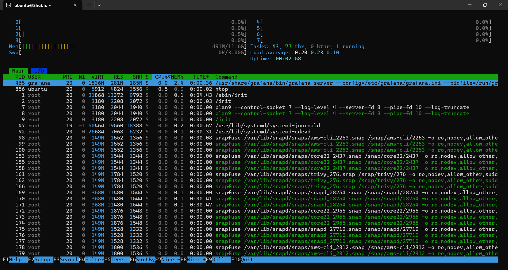
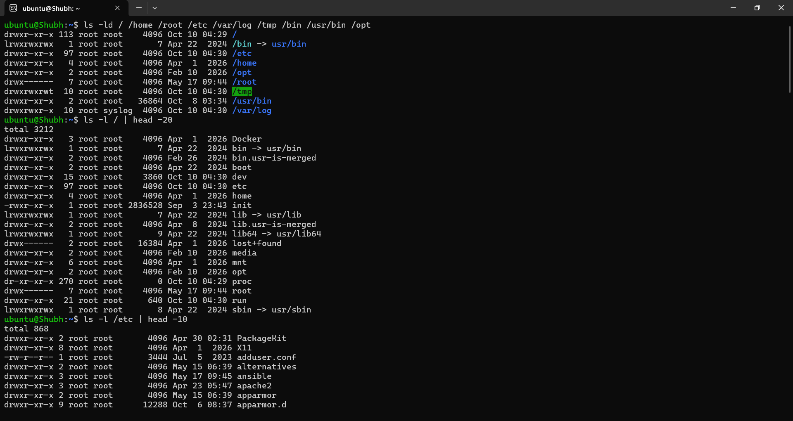
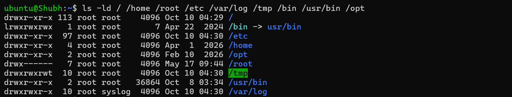
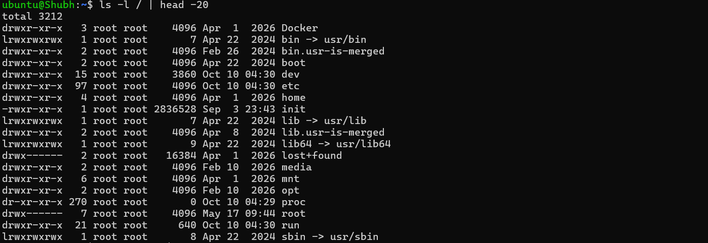
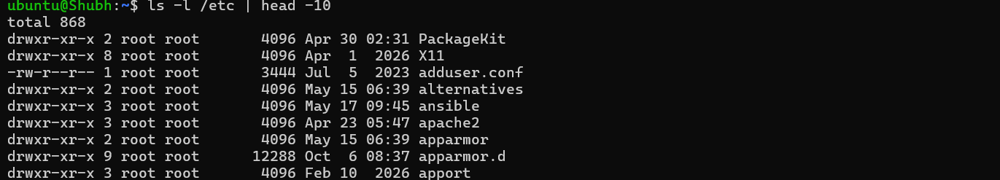
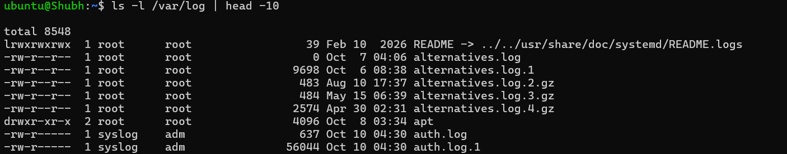
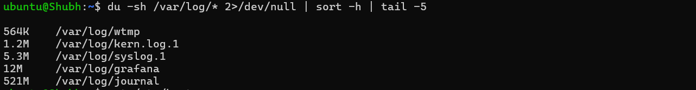
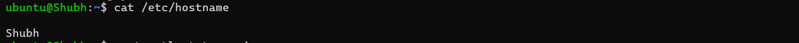
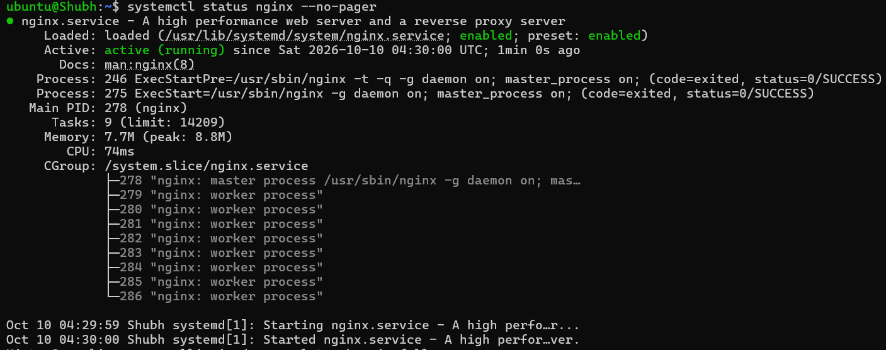
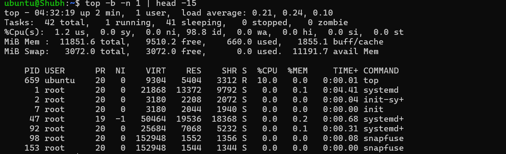
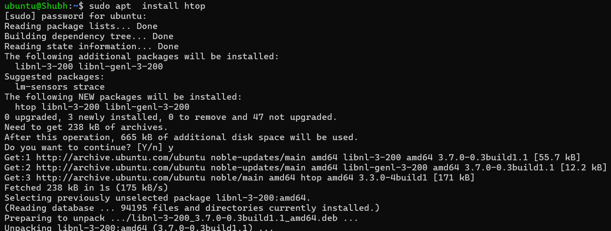
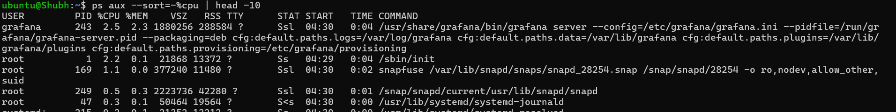
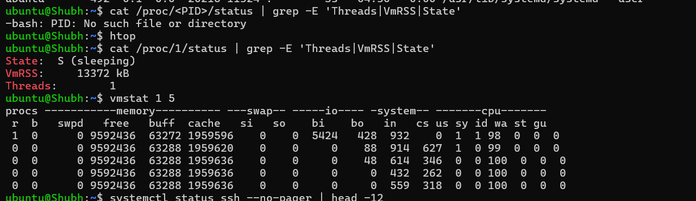
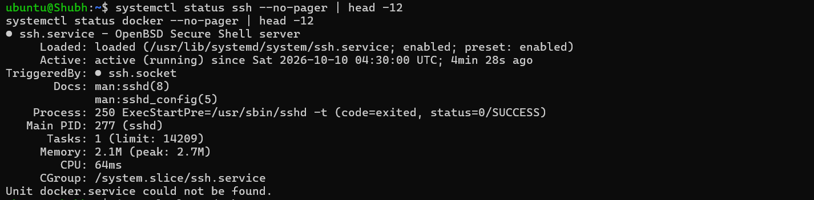
